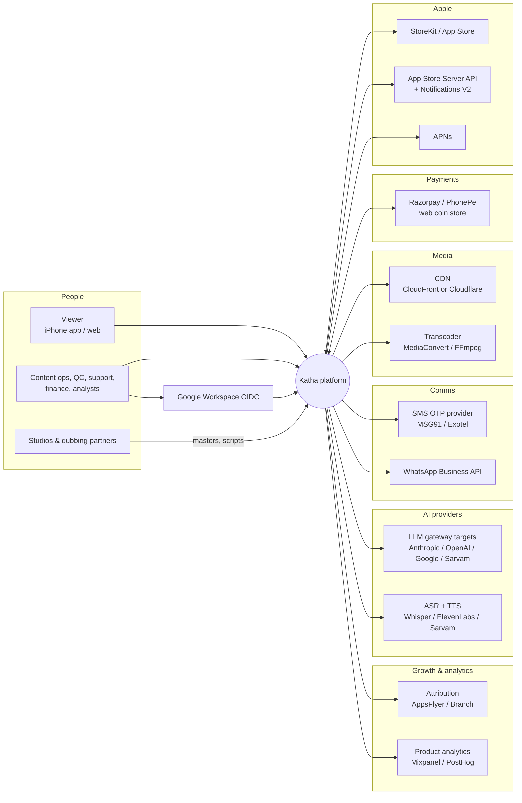
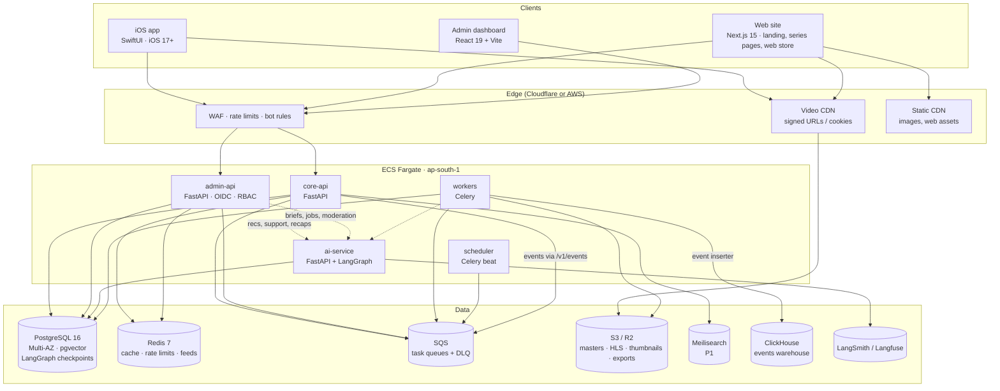
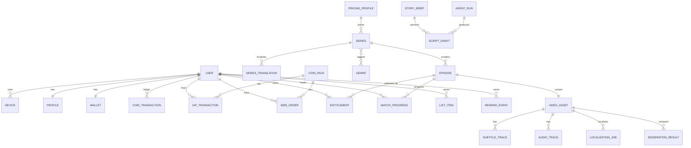
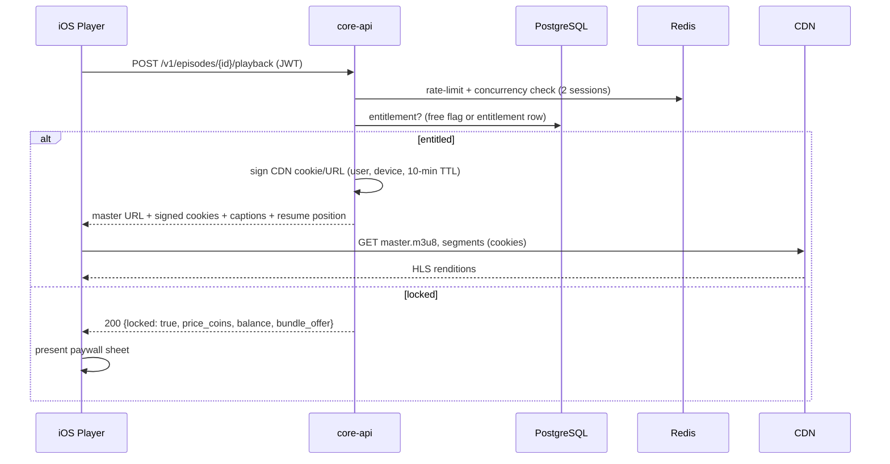
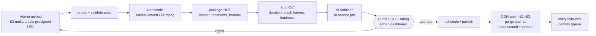
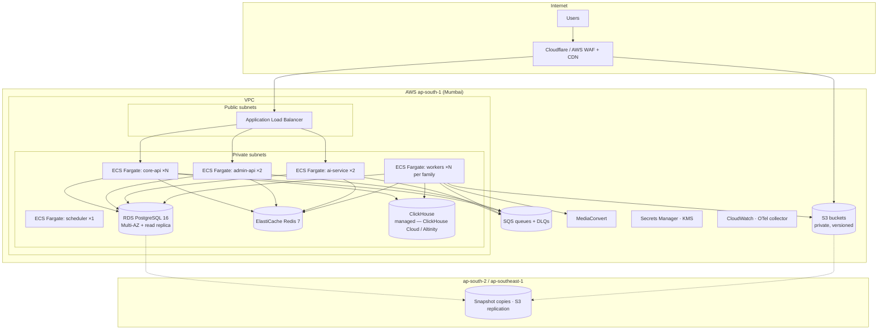

# Project Katha — Software Architecture Document (SAD)

| | |
|---|---|
| **System** | India-first micro-drama platform: iOS app (SwiftUI), web (Next.js), admin (React), Python/FastAPI backend, LangGraph AI platform |
| **Version / Status** | v0.2 — v0.1 design + the as-built record of the working system (§15) |
| **Date** | 2 September 2026 (v0.1: 31 August 2026) |
| **Source of requirements** | PDD v0.3 (product, monetization, compliance, roadmap). This document does not restate requirements; it defines how the system satisfies them. |
| **Owners** | Engineering lead (doc owner) · Backend lead · iOS lead · Web lead · AI/ML lead · SRE |

---

## 0. Purpose, scope and how to use this document

This is the engineering-facing description of the system: its boundaries, the pieces it is made of, how they talk, where data lives, how it is deployed and operated, and the decisions behind those choices. It is the reference for design reviews, onboarding and ADRs.

Scope: everything that ships in v1 (PDD §5.1) plus the structural hooks for P1 features (web coin store, AI dubbing, recommendations, App Clip, widgets). Android is out of scope, but the backend is designed so that an Android client is a new consumer of the same contracts, not a new backend.

Companion documents that now exist: OpenAPI contracts (`contracts/openapi/` — core-api 24 paths, admin-api 51 paths, drift-gated in CI), admin sign-in guide (`Katha_Admin_OIDC_Setup_v0.1.md`), production security posture (`Katha_Prod_Security_Posture_v0.1.md`), repo structure (`Katha_Repo_Structure_v0.1.md`). Still to produce: iOS Technical Design, full Infrastructure & Environments, AI Platform Design, formal Threat Model. §15 records where the working system (the dev build shipped 1–2 Sep 2026) implements, simplifies or defers this design.

---

## 1. Architecture goals and constraints

### 1.1 Goals (quality attributes, in priority order)
1. **Playback experience on congested 4G** — first frame ≤ 0.8 s p50 / ≤ 2.0 s p95, rebuffer ratio ≤ 0.5%, instant next-episode on swipe.
2. **Money correctness** — no lost or duplicated coins under any failure; every balance reconstructible from an append-only ledger; refunds and clawbacks handled automatically.
3. **Availability** — 99.9% for core-api, 99.5% playback start success; graceful degradation when any external dependency (App Store, CDN, LLM provider, SMS) fails.
4. **Cost shape** — CDN egress is the dominant variable cost; the architecture must make bitrate, caching and codec choices controllable per segment of users without app releases.
5. **Platform independence of business rules** — pricing, entitlements, ranking, rewards and compliance gates live server-side so Android and web reuse them unchanged.
6. **Security and privacy** — OWASP ASVS Level 2, DPDP-aligned data handling, admin actions fully audited, fraud controls at the edge (App Attest, rate limits).
7. **Operability** — every service ships with SLOs, dashboards, alerts and runbooks; feature flags and kill switches for every user-facing behavior.
8. **Speed of change** — weekly iOS release train; backend deploys several times a day behind canaries; content operations never wait on engineering.

### 1.2 Constraints
- **App Store rules**: digital goods must use StoreKit in-app purchase; no in-app steering to external payment without confirmed policy; account deletion and Restore Purchases required; privacy labels and age rating.
- **India**: personal data hosted in AWS ap-south-1 (Mumbai) with DR in-region or ap-southeast-1; IT Rules 2021 content classification and grievance workflow; TRAI DLT for SMS; GST handling on web-store sales.
- **Team**: two iOS, two to three backend, two web, one AI/ML engineer at build; the architecture must be operable by a team this size (managed services over self-hosted wherever cost allows).
- **Timeline**: 16 weeks to soft launch; foundations frozen by end of week 2.
- **Vendor swappability**: LLM/TTS/ASR providers, CDN, SMS and payment gateway must be replaceable behind adapters without touching business logic.

---

## 2. Architecture principles

1. **Contracts first.** OpenAPI 3.1 for every HTTP interface, JSON Schema for events; clients are generated, never hand-written.
2. **The backend owns the business.** The iOS app renders state and captures intent; it never computes prices, entitlements or eligibility.
3. **Money is an append-only ledger.** Balances are projections; every mutation carries an idempotency key; external payment facts (App Store, gateway) are verified server-side before anything is credited.
4. **Async by default, sync only where the user waits.** Anything longer than ~300 ms (transcoding, AI jobs, notifications, reconciliation) goes through a queue with retries and dead-letter handling.
5. **Cache the catalogue, never the money.** Catalogue reads are cached at the edge and in Redis with explicit invalidation; wallet, entitlement and playback tokens are never cached beyond the client session.
6. **Degrade gracefully.** Every external dependency has a defined fallback: heuristic ranking when ai-service is down, "confirming" state when App Store verification is slow, secondary SMS provider, secondary CDN origin.
7. **Least privilege everywhere.** Separate services with separate credentials; admin behind OIDC + 2FA; service-to-service auth; PII encrypted at rest and redacted in logs and prompts.
8. **Observable from day one.** OpenTelemetry traces across services, structured logs with request and user correlation ids, business metrics next to technical ones.
9. **Config over code.** Prices, free-episode counts, SKUs, ranking weights, experiment variants, kill switches and minimum app version are remote configuration.
10. **Humans in the loop for anything viewers see from AI.** Graph interrupts are first-class; no AI output reaches the catalogue without a recorded human decision.

---

## 3. System context (C4 level 1)



External dependency posture:

| Dependency | Failure impact | Fallback |
|---|---|---|
| App Store Server API | Purchases cannot be verified | Queue verification; client shows "confirming"; credit on retry; alert after 2 min backlog |
| CDN | Playback fails | Second CDN/origin behind the same signed-URL scheme; DNS/feature-flag switch |
| Transcoder | New content delayed | Queue and retry; FFmpeg fallback path; content bench ≥ 6 series per language absorbs delays |
| SMS provider | Login blocked for new users | Secondary provider; Sign in with Apple prominent; circuit breaker per range |
| LLM/TTS providers | AI jobs delayed | Route to alternate provider via gateway; human queue for subtitles; heuristic ranking |
| Payment gateway | Web store down | Switch to fallback gateway; app IAP unaffected |
| Attribution/analytics SaaS | Loss of marketing data | Client buffers events; server-side event store is the source of truth |

---

## 4. Container view (C4 level 2)



Events from every client (iOS, web site) go through `POST /v1/events` on core-api → SQS → a worker inserter into ClickHouse (§6.6); no client or service writes to the warehouse directly.

### 4.1 Container responsibilities

| Container | Responsibilities | Owns data | Does not |
|---|---|---|---|
| **iOS app** | Rendering, gestures, HLS playback, StoreKit purchase UX, local cache of progress and catalogue, analytics capture, deep links, widgets/App Clip (P1) | Local SwiftData cache only | Compute prices, entitlements, eligibility; store secrets |
| **Web site / web app** | Two modes on one Next.js codebase: (a) public, indexable, SSR/ISR — marketing landing, SEO series/episode pages, free-episode playback, legal, deep-link landing; (b) logged-in web watch app + UPI coin store (`noindex`) — vertical hls.js player, phone-OTP auth sharing the app identity, web orders. Reviewed mockups: `Katha_Website_v0.1.html`, `Katha_WebApp_v0.1.html` | Nothing server-side (SSR/ISR + client state); per-viewer session only | Business rules; direct DB access; store payment credentials |
| **Admin dashboard** | Back-office UI for catalogue, media, moderation, users, finance, config, AI review | Nothing | Talk to core-api or DB directly |
| **core-api** | Public API: auth, catalogue, playback authorization, wallet, IAP verification, unlocks, progress, rewards, config, web orders, public web metadata, event ingestion | All product tables | Long-running work; admin operations |
| **admin-api** | Back-office API with RBAC and audit: catalogue CRUD, media workflow, moderation decisions, user/wallet operations, finance, config, AI review | Admin tables (users, roles, audit); writes product tables under audit | Serve end users |
| **ai-service** | LangGraph graphs (writers' room, localization, moderation, recs curation, support, recaps), model gateway, embeddings, evals | `agent_run`, drafts, embeddings, moderation results, checkpoints | Authoritative product state (writes go through domain services) |
| **workers** | Transcode orchestration, QC, publish, notifications, IAP/gateway reconciliation, feed precompute, AI job execution, exports, retention jobs | None (operate on shared tables) | Serve HTTP |
| **scheduler** | Cron: reconciliation, ledger rebuild check, feed batches, retention, DR snapshot checks | None | |
| **PostgreSQL** | System of record: product, ledger, admin, AI, checkpoints, vectors | | Analytics at scale |
| **Redis** | Cache, rate limits, feed candidates, OTP state, idempotency short-term keys | Ephemeral | Any data that cannot be rebuilt |
| **SQS** | Task queues with DLQs per task family | | |
| **S3/R2** | Masters, HLS renditions, subtitles, thumbnails, exports, ledger cold exports | | |
| **ClickHouse** | Events and derived analytics tables (dbt) | | PII |

### 4.2 Service boundaries and the "modular monolith" rule
core-api, admin-api, ai-service and workers share one PostgreSQL database and one `domain` package in v1 (a modular monolith deployed as four processes). The rule that keeps this healthy: **only domain services mutate tables; routers never touch the ORM directly**, and cross-domain calls go through service interfaces. This preserves the option to extract a service (ledger, ai) with its own database later without rewriting call sites.

---

## 5. Component views (C4 level 3)

### 5.1 iOS app

```
App target (composition root, DI, deep-link routing, scene lifecycle)
├── DesignSystem          tokens, components, haptics, motion
├── AppCore               Environment, Config (remote flags), Session, Router, FeatureFlags
├── Networking            OpenAPI-generated client, AuthInterceptor, RetryPolicy, ETagCache
├── Auth                  PhoneOTP, SignInWithApple, GuestIdentity, TokenStore (Keychain), AppAttest
├── Feed                  HomeView/VM, RowView, ForYouPager, TrailerAutoplayManager
├── Series                SeriesView/VM, EpisodeGrid, EntitlementState
├── Player                PlayerView (UIViewRepresentable → AVPlayerLayer), PlayerCoordinator,
│                         PrefetchManager (next episode), GestureLayer, CaptionsController,
│                         CaptureProtection, QoETelemetry
├── Wallet                StoreKitClient (Product/purchase/Transaction.updates), PurchaseFlow,
│                         WalletStore, PaywallSheet, PacksSheet
├── Rewards               CheckInCard, StreakStore
├── Persistence           SwiftData: WatchProgress, CachedSeries, CachedEntitlement, PendingEvents
├── Analytics             EventQueue (batching, offline buffer, consent), EventSchema
└── Localization          String catalogs, Indic helpers, number/date formatting
```

Key runtime rules: one `@Observable` view model per screen; navigation via typed routes on `NavigationStack`; all network calls `async`; the Player module exposes a single `PlayerCoordinator` actor that owns the two `AVPlayer` instances (current and prefetched next); StoreKit transactions are finished only after server confirmation; every write to SwiftData goes through `Persistence` so cache invalidation is centralized.

### 5.2 core-api (FastAPI)

```
core-api/
├── app.py                         FastAPI app, middleware (request id, OTel, auth, rate limit)
├── routers/                       thin HTTP layer, one file per area (auth, me, catalog, playback,
│                                  entitlements, wallet, iap, engagement, config, web_orders, public, events)
├── deps/                          auth (JWT/App Attest), db session, redis, current_user, idempotency
└── (imports) packages/domain      catalog, playback, wallet, entitlements, rewards, progress,
                                   notifications, config, feed, users
    packages/ledger                Ledger (append + project), IAPVerifier (App Store Server Library),
                                   GatewayVerifier (Razorpay), Reconciler
    packages/infra                 db (SQLAlchemy async), cache, queue (SQS publisher), storage (S3),
                                   cdn_signer, sms, apns, metrics
```

Request path for a typical read: router → dependency-injected `Service` → repository → SQLAlchemy async session → Postgres, with Redis read-through caching in the service layer and ETag generation in the router. Writes to money go through `packages/ledger` only.

### 5.3 ai-service (FastAPI + LangGraph)

```
ai-service/
├── api/                    writers_room, localize, moderate, recs, support, recaps
├── graphs/                 one module per graph: nodes, edges, interrupts, schemas
├── gateway/                model routing (LiteLLM), budgets, caching, redaction, policy filters
├── retrieval/              embeddings, pgvector repositories, RAG for help center
├── evals/                  golden sets, judges, regression harness
└── checkpointer            langgraph-checkpoint-postgres (shared PostgreSQL)
```

Contract with the rest of the system: ai-service never writes catalogue or ledger tables directly; it writes its own tables (`agent_run`, `script_draft`, `localization_job`, `moderation_result`, `embedding`) and emits queue messages that domain services consume to attach approved outputs (e.g., a subtitle track) to product entities.

### 5.5 web (Next.js — public site + web watch app)
One Next.js 15 codebase serving two modes against core-api's public and web-order endpoints:

```
web/site/
├── (public)              SSR/ISR, indexable: landing, /{locale}/series/{slug}[/e/{n}],
│                         legal, grievance; JSON-LD (TVSeries/TVEpisode/VideoObject),
│                         hreflang, canonical, OG + Twitter cards, AASA deep-link landing
├── (app)                 logged-in, noindex: home/browse/search/my-list, vertical player,
│                         coin store, profile — reviewed mockup Katha_WebApp_v0.1.html
├── player/               hls.js wrapper (native HLS on Safari); same POST /v1/episodes/{id}/playback
│                         → signed URL/cookies as iOS; free episodes in v1
├── store/                web orders: POST /v1/web/orders → hosted UPI checkout → poll order status;
│                         never handles the UPI PIN/credentials (merchant-of-record via gateway)
└── auth/                 phone-OTP sharing the app identity; Private Access Tokens for bot defence
```

Rules: the web app computes nothing about money or entitlements — it renders core-api state and, after a web coin purchase, follows the §21.4/§5.3-PDD resolution (recommended: deep-link the unlocked episode into the iOS app rather than play paid content in-browser, keeping paid web playback at P2). Web emits analytics only through `POST /v1/events`, never to the warehouse directly.

### 5.4 workers (Celery task families)

| Family | Tasks | Queue | Retry policy |
|---|---|---|---|
| media | probe, transcode (MediaConvert job + poll), package, thumbnails, auto-QC, publish, cdn-warm | `media` | 5 retries, exponential; DLQ alert |
| money | verify-iap-async, gateway-webhook-process, reconcile-ledger (nightly), refund-clawback | `money` | idempotent; 10 retries; DLQ page |
| comms | push-send, push-campaign, sms-send, whatsapp-send | `comms` | 3 retries; quiet-hours aware |
| feed | precompute-candidates (hourly), rebuild-embeddings (nightly) | `feed` | best effort |
| ai | subtitle-job, dub-job, moderation-pass, writers-room-step, recap-generate | `ai` | provider-aware retries; budget checks |
| housekeeping | retention-purge, deletion-propagate, export-ledger-cold, dr-snapshot-check | `ops` | alert on failure |

---

## 6. Data architecture

### 6.1 Ownership and storage choices
One PostgreSQL cluster in v1, logically partitioned into schemas by domain (`catalog`, `identity`, `ledger`, `engagement`, `admin`, `ai`, `langgraph`). Each schema has exactly one owning domain package; cross-schema joins are allowed in read models but never in write paths. Redis holds only rebuildable state. Object storage holds all media. ClickHouse holds events and analytics models; it never holds direct PII (pseudonymous ids only).

### 6.2 Core entity model



Full column definitions, indexes and constraints live in the Data Model & Migration Plan; PDD §12.4 lists the fields.

### 6.3 Ledger design (the money model)
- `coin_transaction` is **append-only**: `(id, user_id, type, amount_bought, amount_bonus, reference_type, reference_id, idempotency_key UNIQUE, created_at)`. No updates, no deletes; corrections are new rows.
- `wallet(balance_bought, balance_bonus, version)` is a projection updated in the same DB transaction as the ledger row, with optimistic locking on `version`.
- Every entry point (IAP verify, gateway webhook, unlock, check-in, referral, admin adjust, refund clawback) computes a deterministic idempotency key; a duplicate returns the original result.
- Spend order: bonus first, then bought. Negative balances are allowed only via `refund_clawback`; unlocks are blocked while negative.
- Nightly `reconcile-ledger` recomputes balances from the ledger and compares with `wallet`; drift pages on-call. A monthly cold export of the ledger goes to object storage with object lock.
- External facts are verified before credit: App Store JWS via Apple's App Store Server Library; gateway webhooks via HMAC signature plus a fetch-back of the payment from the gateway API.

### 6.4 Caching strategy

| Data | Where | TTL | Invalidation |
|---|---|---|---|
| Home feed per (language, segment) | Redis | 60 s | Time-based; publish events warm the next window |
| Series page, episode list | Redis + client ETag | 60 min / ETag | Explicit purge on publish, price or status change |
| Config and flags | Redis + client | 5 min | Version bump on change |
| Coin packs (SKUs) | Redis + client | 60 min | Purge on change |
| Entitlements | Client SwiftData (revalidated on launch) | Session | Server is authoritative on every unlock/playback call |
| Wallet balance | Client display cache only | Until next server response | Never trusted for decisions |
| Playback tokens / signed URLs | None | 10 min validity | Re-requested per episode |
| OTP state, rate-limit counters | Redis | Minutes | Natural expiry |
| Recommendation candidates | Redis | 1 h | Feed batch overwrite |

### 6.5 Media storage layout
`s3://katha-media/{env}/masters/{asset_id}/source.mp4` (versioned, replicated) · `.../hls/{asset_id}/{rendition}/...` · `.../hls/{asset_id}/master.m3u8` · `.../subs/{asset_id}/{lang}.vtt` · `.../audio/{asset_id}/{lang}/...` · `.../thumbs/{asset_id}/...`. Lifecycle: masters to infrequent-access after 90 days, never deleted while the episode exists; HLS stays hot. Public delivery only through the CDN with signed cookies (CloudFront) or signed URLs (Cloudflare) — bucket is private.

### 6.6 Search, vectors and analytics
- Search: Postgres full-text on localized titles/synopsis with transliteration synonyms in v1; Meilisearch index fed by publish events in P1.
- Vectors: `pgvector` tables for series/episode embeddings (per language) and user taste vectors; HNSW indexes; rebuilt nightly, updated incrementally on publish.
- Analytics: clients batch events to `POST /v1/events` → SQS → ClickHouse inserter; dbt models for sessions, user-day facts, content facts and revenue facts (revenue always derived from the ledger, not events). Pseudonymous `analytics_id` per user; mapping table lives in Postgres under restricted access.

### 6.7 Retention and deletion
Events 24 months then aggregated; PII deleted 30 days after account deletion; `deletion-propagate` removes the user from Postgres PII columns, Redis, ClickHouse mapping, vector stores, trace stores and the helpdesk via API; ledger rows are retained with the user id pseudonymized (financial record). Backups are excluded from immediate deletion and expire on their own schedule (documented in the privacy notice).

---

## 7. Key runtime flows

### 7.1 Playback authorization



Design notes: the endpoint is idempotent and cheap (two indexed lookups, one signature); signed cookies cover all segments of the asset so the client makes one authorization call per episode; concurrency is enforced by a Redis set of active playback sessions with 10-minute expiry refreshed by progress pings.

### 7.2 Purchase → verify → credit → unlock
Documented in PDD §9 (sequence diagram). **Optimistic unlock (PDD §6.2):** with sufficient balance the client dismisses the paywall and resumes playback immediately while `POST /unlock` completes in the background; if the unlock fails (network, race on balance), playback pauses at the next segment boundary, a toast explains, and the paywall returns with state preserved — the ledger, not the client, remains authoritative. Architecture-relevant guarantees: the app calls `transaction.finish()` only after the server returns a credited response; `POST /v1/iap/verify` is idempotent on `transactionId`; a `Transaction.updates` listener at app launch re-submits anything unfinished; the `money` worker family re-verifies queued transactions if the App Store Server API was unavailable; App Store Server Notifications V2 (`REFUND`, `REVOKE`, `CONSUMPTION_REQUEST`) are verified and processed asynchronously with the same idempotency scheme.

### 7.3 OTP login with App Attest

```mermaid
sequenceDiagram
    participant App as iOS app
    participant AA as Apple App Attest
    participant API as core-api
    participant RD as Redis
    participant SMS as SMS provider

    App->>AA: generate key + attest (first run)
    AA-->>App: attestation
    App->>API: POST /v1/auth/otp/request {phone, attestation/assertion}
    API->>API: verify assertion (Apple root), check device risk
    API->>RD: rate limits (phone, IP, device) + range rules
    alt allowed
        API->>SMS: send OTP (DLT template)
        API-->>App: 202 {request_id}
        App->>API: POST /v1/auth/otp/verify {request_id, code}
        API->>RD: verify + consume
        API-->>App: access JWT (15 min) + refresh (30 d) ; merge guest identity
    else blocked
        API-->>App: 429 / fallback to Private Access Token or Sign in with Apple
    end
```

### 7.4 Content publish pipeline



Each stage is a Celery task with its own retry policy; state is persisted on `video_asset.transcode_status` and `episode.status` so the dashboard shows exactly where an episode is; a stuck stage (> 2× expected duration) raises an alert.

### 7.4a Web coin purchase (UPI)
`POST /v1/web/orders {pack}` (auth: same phone identity as the app) → core-api creates a gateway order (Razorpay) and returns `order_id` + public key → browser opens hosted UPI checkout (QR / PhonePe / GPay / Paytm / VPA); **the PIN and credentials never touch Katha** → gateway webhook `POST /v1/webhooks/razorpay` (HMAC-verified, idempotent by payment id) credits the ledger with `source=web` and the +10% web bonus, and issues a GST invoice → the browser, which has been polling `GET /v1/web/orders/{id}` (or is woken by a silent push), shows "coins added" while a silent push refreshes the app's wallet. The "Waiting for UPI confirmation…" state is the async webhook gap, not a synchronous charge. Refunds: unspent web coins within 7 days, to source only.

### 7.5 Recommendations serving
Hourly `precompute-candidates` writes ranked candidates per (language, segment) to Redis; `GET /v1/home` reads the candidate list, applies per-user filters (rating, parental lock, already-completed) and a lightweight re-rank in core-api (p95 budget 120 ms), and falls back to the heuristic (PDD §12.8) if Redis has no candidates. ai-service is consulted **only** offline (taste-vector interpretation, row-title generation, cached) — never in the request path.

### 7.6 AI subtitle job with human-in-the-loop
`localize-job` (workers) → ai-service graph: ASR → translation with glossary → VTT lint → quality judge → **interrupt** (graph checkpointed) → editor reviews in the admin dashboard → `resume` with edits → publish message → domain service attaches `subtitle_track` to the asset and purges caches. If the provider fails, the job routes to an alternate provider or to a human queue; the checkpoint means partial work is never lost.

---

## 8. Cross-cutting concerns

### 8.1 Identity, authentication and sessions
- **Viewers**: guest identity (device install id → `user` row) upgraded to phone OTP or Sign in with Apple; guest data merged on login. Access JWT 15 minutes (RS256, `kid` rotation), refresh token 30 days stored in Keychain, refresh rotation with reuse detection; server-side revocation list in Redis. Device records with remote logout.
- **Admin**: Google Workspace OIDC (PKCE) with enforced 2FA at the IdP; re-authentication for sensitive actions. *As built (§15.2):* admin-api is itself the OIDC relying party (code + PKCE, RS256/JWKS verification, nonce binding, optional `hd` check) with a built-in dev IdP when no issuer is configured; sessions are stateless HMAC-signed HttpOnly cookies (12 h, SameSite=Lax, CSRF header on mutations); roles resolve on **every request** from a provisioned-operators directory (instant revocation) rather than IdP groups; money actions demand a session younger than 15 min (step-up).
- **Services**: short-lived service tokens (or mTLS inside the VPC) for core-api/admin-api/workers → ai-service; webhooks verified by signature (Apple JWS, Razorpay HMAC).
- **Client integrity**: App Attest on auth, unlock, IAP and rewards endpoints; DeviceCheck bits for first-purchase-offer state; Private Access Tokens on the web.

### 8.2 Authorization
Viewer authorization is entitlement-based (free flag, `entitlement` rows, parental lock PIN for rated content). Admin authorization is RBAC (Admin, Content Ops, QC/Moderator, Finance, Support, Analyst, Read-only) enforced in admin-api dependencies per route and per action, with dual-approval workflows for money actions above thresholds. *As built:* the permission matrix is served from the same table the routes enforce (`/access/matrix`, so docs cannot drift); self-approval is rejected server-side; per-agent daily adjustment caps and per-actor rate limits back the dual-approval rule; granting the admin role needs a typed confirmation, the last admin cannot be removed, and "sign out all devices" bumps a per-user token version that invalidates every earlier viewer JWT.

### 8.3 Configuration and feature flags
`GET /v1/config` returns versioned config (flags, experiment variants, SKUs, pricing defaults, `min_app_version`, ranking weights). Stored in Postgres, cached in Redis, edited in the admin Config module with audit. Kill switches exist for: check-in, referral, offers, web store, AI curation, trailer autoplay, App Attest enforcement (emergency only). *As built:* the control plane is a shared KV table (`admin_kv`) both services read — flags carry owner/review-by metadata, guarded flags need a typed confirmation, and every flag supports **percentage rollout** with stable per-user hash bucketing; a thin experiment registry assigns variants the same way and serves them in `config.experiments`; pack prices, per-series pricing, ratings, lifecycle status, episode retitles and `min_app_version` all flow through the same KV and reach clients on core-api's next request.

### 8.4 Idempotency, errors and rate limiting
Mutating money endpoints require an `Idempotency-Key` header (or derive one); responses are stored 24 h in Redis keyed by (user, key). Errors follow RFC 9457 problem details with stable `type` codes the iOS app maps to localized copy. Rate limits are enforced at the edge (WAF) and in core-api (Redis token buckets per user, IP and endpoint class). *As built:* idempotency is enforced inside the ledger itself (globally-unique keys; replays return the original row); admin-api applies per-actor sliding-window rate limits and per-agent daily coin caps in-app, plus an optional IP allowlist that refuses before auth runs.

### 8.5 Observability
OpenTelemetry SDKs in every service (FastAPI, SQLAlchemy, Celery instrumentation) exporting traces, metrics and structured logs with `request_id`, `user_id` (pseudonymous) and `trace_id`; iOS attaches `X-Request-ID` and reports QoE telemetry (start time, stalls, bitrate switches, errors) as events; dashboards per service on golden signals plus business KPIs; alerts only on SLO impact; Sentry for exceptions in iOS, web and Python; public status page.

### 8.6 Security controls
OWASP ASVS Level 2 checklist enforced in reviews (the ledger and admin coin powers warrant it; most L2 controls are already in this design); TLS 1.2+ everywhere; secrets in AWS Secrets Manager with rotation; PII columns (phone) encrypted with KMS envelope encryption; PII redacted in logs, traces and AI prompts (Presidio); dependency and container scanning in CI; signed webhooks; least-privilege IAM per service; quarterly external pen-test; incident response and disclosure process in the runbooks.

### 8.7 Privacy (DPDP) mapping
Consent captured at first login and stored with version and timestamp; purpose-limited processing documented per data class; rights requests (access, correction, erasure) handled through admin with 30-day SLAs; deletion propagation (§6.7); Indian data residency for the system of record; vendor DPAs and zero-retention settings for AI providers; breach-notification runbook.

### 8.8 Localization and content rating
Localized catalogue fields in `series_translation`; UI strings in iOS String Catalogs and web locale files; ratings and descriptors are first-class entity fields enforced by the playback and feed services (parental lock, age gate), not by client logic.

---

## 9. Deployment view



Admin access: the admin dashboard and admin-api are reachable only through Cloudflare Access (or VPN with IP allowlist) in front of the WAF, per PDD §21.1 — they never share the public ingress path unauthenticated.

### 9.1 Environments
| Env | Purpose | Data | App Store | Notes |
|---|---|---|---|---|
| dev | Shared development | Synthetic | Sandbox | One small stack; feature branches deploy on demand |
| staging | Pre-production, QA, load tests | Synthetic + anonymized samples | Sandbox / TestFlight | Production-parity topology at small scale |
| prod | Live | Real | Production | Change only via pipeline; break-glass access audited |

### 9.2 Delivery pipeline
GitHub Actions: lint → unit tests → contract tests (OpenAPI diff gate) → build container → scan → push to ECR → deploy to dev → integration tests → deploy to staging → smoke → manual approval → prod canary (5%, 30 min, SLO check) → full rollout; automatic rollback on SLO breach. Terraform for all infrastructure with plan/apply in CI and a reviewed state. Database migrations run as a pre-deploy job using expand/contract; no destructive change ships with the code that stops using the column.

### 9.3 Scaling and resilience
ECS autoscaling on request rate (core-api) and queue depth (workers); RDS Multi-AZ with a read replica for admin/analytics; Redis with replica and automatic failover; SQS DLQs per queue with alerts; CDN absorbs read traffic for media and static assets; load tests at 10× expected traffic before launch and before marketing moments; DR: RPO 15 min, RTO 4 h via cross-region snapshot copies and S3 replication, drilled quarterly. The scheduler is a singleton: it emits a heartbeat metric per scheduled job, and a dead-man's-switch alert fires if any job (especially nightly ledger reconciliation) misses its window.

---

## 10. Quality attribute scenarios and tactics

| Scenario | Tactic |
|---|---|
| A user on congested 4G swipes to the next episode; first frame must appear within 0.8 s | Pre-warmed second AVPlayer with the next episode's first ~6 s; 2-second segments; lowest-rendition start with fast step-up; signed cookies already covering the asset; CDN warm on publish |
| The App Store Server API is unreachable for 20 minutes during a purchase spike | Client shows "confirming"; verification queued in `money`; retries with backoff; users can keep watching free episodes; alert after 2 minutes of backlog; no coins credited unverified |
| A marketing moment drives 10× normal traffic in 15 minutes | Autoscaling on request rate; feed served from Redis; catalogue behind ETags and CDN; queue-backed writes for progress and events; load-tested beforehand |
| A refund arrives for coins already spent | Clawback ledger row; negative balance blocks further unlocks; support workflow; no entitlement revocation (viewer-friendly, abuse tracked by ratio) |
| An LLM provider degrades for a day | Gateway routes to an alternate provider; subtitles fall back to the human queue; ranking uses heuristics; costs capped by budgets |
| Android launch in Phase 5 | Same OpenAPI contracts and config; entitlements, pricing and ranking already server-side; Kotlin client generated from the spec |
| A leaked HLS URL is shared publicly | 10-minute signed cookies bound to user/device; concurrency limit; watermark (P1); takedown tooling; DRM (P2) |
| CDN bill exceeds budget | Per-segment bitrate caps via config; HEVC ladder; per-title encoding; multi-CDN with negotiated rates; weekly cost-per-minute review |

---

## 11. Technology stack (pin at Sprint 0)

| Area | Choice | Version policy |
|---|---|---|
| iOS | Swift 6, SwiftUI, iOS 17+, Xcode 16+, AVFoundation, StoreKit 2, SwiftData, WidgetKit/ActivityKit (P1) | Latest stable Xcode; N-1 iOS support |
| Web | Next.js 15, React 19, TypeScript 5, Tailwind CSS, hls.js | LTS-tracking |
| Admin | React 19, Vite, TypeScript, shadcn/ui or Ant Design, TanStack Query/Table/Router, react-hook-form + zod, ECharts, Uppy/tus | |
| Backend | Python 3.12, FastAPI, Pydantic v2, SQLAlchemy 2.0 (async, asyncpg), Alembic, Celery 5, Gunicorn + Uvicorn | Pinned via lock files |
| AI | LangGraph + langgraph-checkpoint-postgres, LiteLLM (or in-house gateway), pgvector, LangSmith or Langfuse, Presidio | Provider versions pinned per graph |
| Data | PostgreSQL 16 (RDS), Redis 7 (ElastiCache), SQS, S3 (or R2), ClickHouse, dbt, Meilisearch (P1) | |
| Media | AWS MediaConvert (FFmpeg fallback), HLS/CMAF, HEVC + H.264 ladders, WebVTT | |
| Edge | Cloudflare (WAF, CDN, Private Access Tokens) or AWS WAF + CloudFront | Decision at Sprint 0 |
| Platform | AWS ap-south-1, ECS Fargate, Terraform, GitHub Actions, Secrets Manager, KMS | |
| Observability | OpenTelemetry, Grafana stack or Datadog, Sentry, public status page | |
| Payments / comms | StoreKit 2 + App Store Server Library (Python), Razorpay (PhonePe/Cashfree fallback), APNs (token auth), MSG91/Exotel/Twilio, WhatsApp Business API | |

---

## 12. Interface contracts

| Interface | Form | Owner | Versioning |
|---|---|---|---|
| core-api public API | OpenAPI 3.1 (`/v1`) | Backend | Additive changes only within v1; breaking → `/v2` with 6-month overlap; `min_app_version` for hard cut-offs |
| admin-api | OpenAPI 3.1 (`/admin/v1`) | Backend | Same rules; consumers are internal |
| ai-service internal API | OpenAPI 3.1 (`/ai/v1`) | AI/ML | Internal; contract tests from callers |
| Analytics events | JSON Schema registry (name, version, properties) | Data | New version per breaking change; CI blocks unregistered events |
| Queue messages | Pydantic models in `packages/domain.messages` | Backend | Versioned `type` field; consumers ignore unknown fields |
| Webhooks (inbound) | Apple App Store Server Notifications V2 (JWS), Razorpay (HMAC) | Backend | Verify, dedupe by event id, process async |
| CDN signing | CloudFront signed cookies / Cloudflare signed URLs | Backend | Key rotation quarterly |
| Deep links | Universal Links (AASA), short links `/e/{code}` | Web + iOS | Route table versioned in config |

---

## 13. Decision log (ADR index)

| ADR | Decision | Status |
|---|---|---|
| ADR-001 | iOS-first (SwiftUI, iOS 17+) as premium beachhead; Android on same backend in Phase 5 | Accepted — pending PDD §19.1 confirmation |
| ADR-002 | FastAPI-only backend (no Django); modular monolith deployed as four services sharing one PostgreSQL | Accepted |
| ADR-003 | Append-only coin ledger with projected wallet; server-side verification of all payment facts | Accepted |
| ADR-004 | StoreKit 2 with finish-after-server-credit; web store via gateway as P1, policy-gated | Accepted |
| ADR-005 | HLS/CMAF with HEVC + H.264 ladders, signed cookies, no DRM in v1 | Accepted — pending PDD §19.7 confirmation |
| ADR-006 | LangGraph on Postgres checkpointer for all AI workflows; humans-in-the-loop mandatory for viewer-facing outputs | Accepted |
| ADR-007 | AWS ap-south-1 on ECS Fargate with Terraform; managed services over self-hosted | Accepted |
| ADR-008 | Next.js for the public site; React + Vite for admin; no admin on core-api | Accepted |
| ADR-009 | Events to ClickHouse via SQS; revenue derived from the ledger, never from events | Accepted |
| ADR-010 | App Attest required on auth/money/reward endpoints; Private Access Tokens on web | Accepted |
| ADR-011 | Managed transcoding (MediaConvert) in v1 with FFmpeg fallback; self-hosted at scale | Proposed |
| ADR-012 | Edge provider: Cloudflare vs AWS WAF + CloudFront — includes the playback-auth scheme (CloudFront signed cookies vs Cloudflare Worker token validation) and the multi-CDN failover design; not just a vendor pick | Open — decide at Sprint 0, before contract freeze |
| ADR-013 | Analytics SaaS vs self-hosted (Mixpanel/Amplitude vs PostHog) | Open |
| ADR-014 | LLM/ASR/TTS provider matrix and data-residency posture | Open — Phase 0 evals |

| ADR-015 | Admin-api is its own OIDC relying party with stateless signed-cookie sessions and a built-in dev IdP; Google Workspace is pure configuration | Accepted — built |
| ADR-016 | Dev-parity persistence: both services share one SQLite ledger DB (`KATHA_PERSIST=1`), with the `admin_kv` table as the config control plane; Postgres/Redis replace the engine at deploy time, not the seams | Accepted — built |
| ADR-017 | Product events are emitted server-side by core-api at observable moments (no client SDK in v1); analytics derive from the event table + the ledger | Accepted — built |
| ADR-018 | Committed OpenAPI contracts with two-sided drift gates (server test + client path-inventory test) instead of generated client SDKs in v1 | Accepted — built |

Each ADR is a one-page record (context, decision, consequences, alternatives) in `docs/adr/`.

---

## 14. Risks, technical debt and open questions

**Architectural risks**
- Shared database across four services is a coupling risk if boundaries erode — enforced by the "services mutate, routers don't" rule and by schema ownership reviews.
- CDN cost is the largest run-rate variable; the design assumes negotiated rates and HEVC adoption on the iOS install base.
- App Attest adds latency to auth and unlock paths (tens of ms) and a support burden on unsupported devices/jailbreaks — keep an emergency flag to relax enforcement.
- LangGraph checkpoints in the primary Postgres can grow quickly — separate schema, retention job, and a path to a dedicated instance.
- Multi-CDN failover is promised in §3 but CloudFront (signed cookies) and Cloudflare (Worker-validated tokens) use incompatible playback-auth schemes; a real failover needs a signing abstraction and a client that handles both token styles, designed as part of ADR-012. Until then, treat CDN failover as a manual, hours-scale runbook, not a flag flip.

**Accepted debt for v1**
- Postgres full-text search instead of Meilisearch; heuristic ranking instead of the embedding pipeline; no DRM; no offline downloads; manual CSV import where admin modules lag.

**Open questions**
- Cloudflare vs AWS at the edge (ADR-012). Managed video platform for the first months vs self-hosted HLS from day one (PDD §19.4). Whether ai-service should run graphs in-process or exclusively on workers at launch. Exact App Attest enforcement level for guests.

---

## Appendix A — Repository layout

```
katha/
├── backend/
│   ├── packages/domain/        # models, schemas, services per domain (catalog, identity, ledger, ...)
│   ├── packages/ledger/        # ledger + verifiers (pure, 100% tested)
│   ├── packages/infra/         # db, cache, queue, storage, cdn, sms, apns, metrics
│   ├── services/core-api/
│   ├── services/admin-api/
│   ├── services/ai-service/
│   ├── services/workers/
│   └── alembic/
├── ios/                        # Xcode project + Swift packages (modules in §5.1)
├── web/site/                   # Next.js
├── web/admin/                  # React + Vite
├── contracts/                  # OpenAPI specs, event schemas, message models (source of truth)
├── infra/terraform/            # environments, modules
├── docs/                       # PDD, SAD, ADRs, runbooks, design notes
└── .github/workflows/
```

## Appendix B — Environment variables (core-api sample)
`DATABASE_URL`, `REDIS_URL`, `SQS_QUEUE_URLS` (per family), `S3_BUCKET_MEDIA`, `CDN_SIGNING_KEY_ID` (Secrets Manager reference), `APP_STORE_ISSUER_ID`, `APP_STORE_KEY_ID`, `APP_STORE_PRIVATE_KEY_REF`, `APP_STORE_BUNDLE_ID`, `RAZORPAY_KEY_ID`, `RAZORPAY_SECRET_REF`, `RAZORPAY_WEBHOOK_SECRET_REF`, `SMS_PROVIDER`, `SMS_API_KEY_REF`, `APNS_TEAM_ID`, `APNS_KEY_ID`, `APNS_PRIVATE_KEY_REF`, `JWT_SIGNING_KEY_REF`, `JWT_ISSUER`, `APP_ATTEST_ENFORCE` (`strict|soft|off`), `AI_SERVICE_URL`, `AI_SERVICE_TOKEN_REF`, `OTEL_EXPORTER_OTLP_ENDPOINT`, `SENTRY_DSN`, `FEATURE_FLAG_CACHE_TTL`. Secrets are referenced, never inlined.

## Appendix C — Naming and conventions
Tables `snake_case` singular; ids UUIDv7; money in integer minor units; timestamps UTC `timestamptz`; API paths plural nouns, kebab-case; events `snake_case` verbs; Swift modules `PascalCase`; feature flags `area.behavior` (e.g., `rewards.checkin_enabled`); queues `katha-{env}-{family}`; ADRs `ADR-NNN-title.md`.

---

**Changelog**
- **v0.1.2 (31 Aug 2026):** web watch app added — §4.1 container split into public site + logged-in web app; new §5.5 component view (Next.js public/app modes, hls.js player, UPI store, shared identity); new §7.4a web-UPI-purchase flow; flags the PDD §21.3/§5.3 scope question (web coin unlock → web playback [P2] vs deep-link to app). Reflects reviewed mockup `Katha_WebApp_v0.1.html`.
- **v0.1.1 (31 Aug 2026):** review fixes — ASVS target raised to Level 2 (§1.1, §8.6); events flow corrected in the container diagram (clients → /v1/events → SQS → inserter → ClickHouse); ClickHouse pinned to a managed offering; admin access layer (Cloudflare Access/VPN) stated in the deployment view; optimistic-unlock reconciliation added to §7.2; scheduler dead-man's-switch added to §9.3; ADR-001/005 flagged as pending PDD §19 confirmation; ADR-012 expanded to cover the playback-auth scheme and multi-CDN failover design; multi-CDN auth risk added to §14.

*End of SAD v0.1. Next documents in the engineering starter pack: OpenAPI contracts → Data Model & Migration Plan → iOS Technical Design → Service Design Notes → Infrastructure & Environments → Security & Threat Model → AI Platform Design → Event Tracking Plan → Test Strategy → ADRs → Sprint 0 plan.*

---

## 15. As-built addendum (v0.2 — the working system, 2 September 2026)

This section records what the running dev build implements. Where it differs from §§1–14, the difference is deliberate: dev-parity substitutions (SQLite for Postgres, in-process for Redis/SQS) keep every *seam* identical so the deploy-time swap changes engines, not architecture.

### 15.1 What runs
Two FastAPI services over **one shared ledger DB** — core-api (:8799, 24 contract paths) and admin-api (:8800, 51 paths) — plus the Next.js site, the React back office and the SwiftUI app. Verified money loop on every surface: guest → buy pack (IAP stub / UPI stub with the +10% web bonus) → bonus-first unlock → HLS playback with real expiring URLs; an admin wallet adjustment is visible to the app **without restart** (the persistent ledger folds foreign rows by idempotency key on read).

### 15.2 Admin platform (the 112-finding review, all implemented)
- **Auth**: OIDC RP in admin-api (code+PKCE; RS256 via issuer JWKS; iss/aud/exp/nonce/email_verified/`hd` checks). Built-in dev IdP with the identical verification path; `KATHA_OIDC_ISSUER=https://accounts.google.com` switches to Workspace with zero code change. Stateless HMAC sessions (12 h) + flow-state cookies → multi-instance needs no session store. Roles from the `adminuser:` directory per request; provisioning UI with typed-confirm admin grants and last-admin protection. Step-up: money actions refuse sessions older than 15 min.
- **Money desk**: server-side user search (SQL filter/sort/page), risk flags, refunds via ledger clawback, DPDP export/erase, dual approval with balance context, daily caps, rate limits.
- **Governance**: every mutation lands in a **hash-chained audit** (sha256 link per row, actor IP/UA); the chain is re-verified on every read and a raw-SQL tamper flips it to unverified. Annotations attach *beside* rows, never inside. Auth events (login/denial/logout/grant/revoke) share the chain.
- **Catalog levers**: draft series created in the panel reach the public API only when published; per-series pricing overrides change both the paywall ask and the ledger charge; episode retitles; rights/licence tracking with expiry warnings; live-counts derived from media on disk.
- **Compliance**: grievance intake on core-api → SLA-timed queue (24 h ack / 15 d resolve) with breach items on the attention rail, mirrored once to a Slack-compatible webhook.

### 15.3 Events and analytics (v1 of §6.6/§13)
core-api emits server-side events (`paywall_view`, `play_start`, `play_progress` with clamped watch-time deltas, `purchase` with channel, `unlock`, `checkin`, `grievance`) into a shared `event` table — best-effort, never blocking a money path. The admin analytics rollup computes daily buckets, Today/7d/30d windows with period deltas, the paywall→purchase→unlock funnel, revenue split by channel, refund ratio, coin-liability trend and 90-day breakage. ClickHouse/SQS remain the scale-out path (ADR-009); the emission points and event shapes are already fixed.

### 15.4 Contracts and quality gates
Committed OpenAPI for both services; `tools/gen_admin_types.py` regenerates the admin contract **and** a client-side path inventory; CI fails on drift from either side (a backend test compares the live app to the committed contract; a frontend test parses the client and rejects calls to unknown paths). Coverage gates enforced per surface: backend **100%** (179 tests, gate 98), web/admin **98.9/95.6/97.2** (218 tests, gates 98/95/96) plus a Playwright money-path e2e in real Chrome, web/site **98.9/95.1/97.9** (76 tests), KathaKit **100%** (77 tests, gate 98) plus a 12-flow XCUITest suite green on simulator and a physical iPhone 16.

### 15.5 Deferred to deploy time
Postgres + Redis + SQS/ClickHouse engine swaps; KMS/secret-manager and VPN/IP-allowlist activation (documented in `Katha_Prod_Security_Posture_v0.1.md`); real Apple/Razorpay verification behind the existing stubs; CDN signing (ADR-012); the ai-service and workers remain scaffolds.
