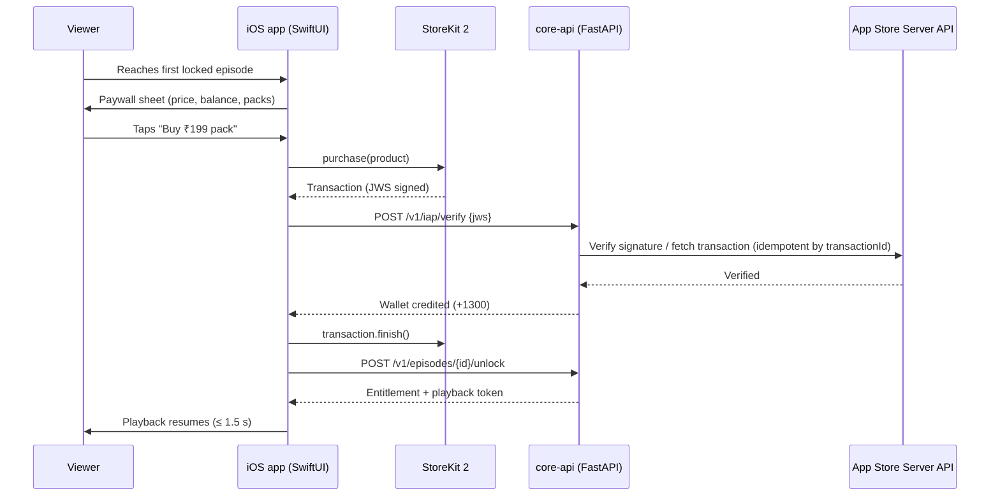
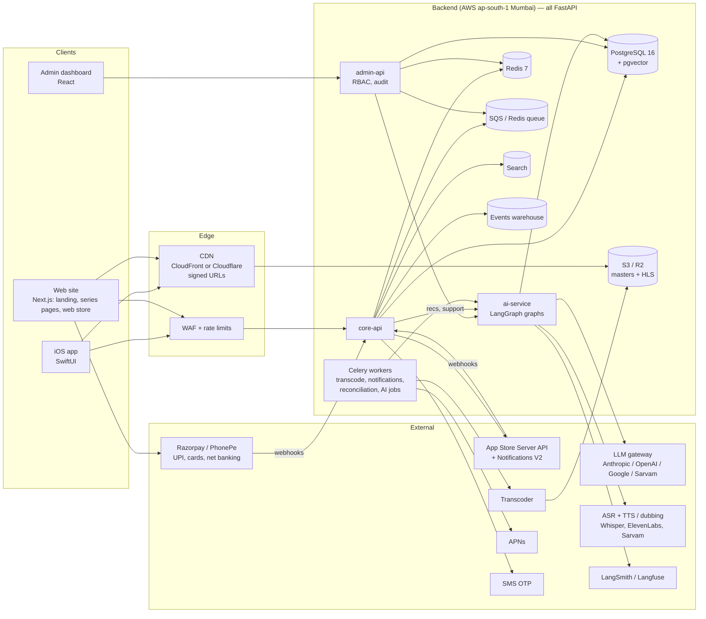
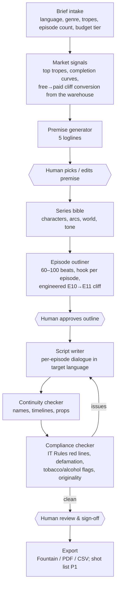

# Project Katha (working title) — Product Design & Requirements Document (PDD)

| | |
|---|---|
| **Product** | India-first micro-drama streaming app — native iOS (SwiftUI) · FastAPI backend · Next.js web · React admin · LangGraph AI platform |
| **Monetization** | Coin unlock (pay per episode), consumable in-app purchase |
| **Version / Status** | v0.3 — draft for review (adds content strategy, growth engine, design depth, iOS-native features, trust & safety, SRE, QA, data, financial model, support, governance, legal pack) |
| **Date** | 31 August 2026 |
| **Owners** | Product (doc owner) · Design · iOS Eng · Backend Eng · Web Eng · AI/ML Eng · Head of Content · Growth · Data · SRE · Legal/Finance |

> "Katha" (story) is a placeholder. Run a trademark and App Store name search before using any name.

---

## 0. How to read this document

- **§1–5** — why, who, what (everyone).
- **§6–10** — product spec: principles, content model, coin economy, flows, screen specs (product, design, QA).
- **§11–14, §21–22** — engineering: iOS architecture, FastAPI backend, data model, APIs, video pipeline, payments; web surfaces and admin dashboard (§21); LangGraph AI platform (§22).
- **§15–20** — analytics, compliance, roadmap, team, risks, decisions.
- **§23–34** — the operating plan around the product: content strategy and production ops, growth engine, design depth, iOS-native features, trust & safety, reliability, QA, data maturity, financial model, support, team governance, legal pack.

Requirement tags: **P0** = must ship in v1 (MVP). **P1** = fast-follow within 90 days of launch. **P2** = later.
Numbers marked *assumption* are starting points to validate with experiments, not facts.

---

## 1. Executive summary

Katha is a vertical, mobile-first streaming app for serialized **micro-dramas**: 50–100 episodes of 60–120 seconds each, every episode ending on a cliffhanger, in Hindi and major Indian languages. Viewers watch the first ~10 episodes of any series free, then **unlock episodes with coins** bought through App Store in-app purchase. There are no ads in v1.

v1 ships on **iOS 17+ with SwiftUI**, backed by an **all-FastAPI Python backend** (core-api, admin-api, ai-service and Celery workers), a **Next.js web site** (marketing landing page, legal and grievance pages, series/episode pages with free-episode playback and deep links, and a policy-gated **web coin store with UPI** as a fast-follow), a **React admin dashboard** for content operations, moderation, finance and support, an HLS video pipeline on an India-region CDN, and a **LangGraph AI platform** for script and story generation (writers' room), personalization, AI subtitles and dubbing, and support/moderation — with humans signing off everything viewers see.

v0.3 adds the operating plan that turns the product into a business: a content strategy with budget tiers and stage-gated greenlighting (§23), a growth engine built around a clip factory and cohort-gated paid acquisition (§24), design and research depth (§25), iOS-native features that earn App Store featuring (§26), fraud and abuse defences (§27), reliability and QA practices (§28–29), a data platform (§30), an honest financial model (§31), support operations (§32), team governance (§33) and the legal pack (§34). The financial model's headline is sobering and important: at Indian price points this business needs several million MAU — or much cheaper content — to break even, which is why Android and AI-assisted production sit firmly on the roadmap.

**Why now.** India's micro-drama market went from near zero to an estimated $300–500M in roughly a year, with ~100M monthly active users and 450M+ downloads (Lumikai / ThePrint, 2026), and micro-drama apps now out-download Netflix and ZEE5 in Indian app stores (FICCI–EY, 2026). Incumbents are Android-heavy and either free-with-ads (JioHotstar Tadka) or subscription (Kuku TV). Nobody is serving the smaller but higher-spending iPhone segment with premium, ad-free, pay-as-you-go originals in Indian languages.

**Two strategic caveats to accept up front (details in §18–19):**
1. iOS is a single-digit share of India's smartphone base. iOS-first is a **premium beachhead and proving ground**, not the volume play. The backend, CMS and content engine are built platform-agnostic so Android can launch on the same stack within one to two quarters.
2. Apple requires in-app purchase for digital goods and takes 15–30% commission on top of 18% GST. This shapes coin-pack design (§8) and rules out in-app UPI checkout for coins unless Apple's India policy changes.

---

## 2. Market context (from research, August 2026)

| Topic | What the data says | Source |
|---|---|---|
| Market size | India micro-drama ≈ $300–500M revenue, ~100M MAU, 450M+ downloads; growth of up to 91% projected for 2026; $4.5B by 2030 forecast (estimates vary: another cited path is $1.5B → $6.5B by 2033) | Lumikai / ThePrint; Inc42 |
| Leaders | Kuku TV: 200M+ downloads, ₹899/yr ad-free subscription, FY26 revenue ₹1,400+ Cr, IPO filed June 2026. JioHotstar Tadka: free, ad-supported, 100M users in ~2 months (Apr–Jun 2026). Story TV (Eloelo): 1 crore+ users by Oct 2025, big South-India slate. Quick TV (ShareChat): 10M downloads in 3 months, AI-produced slate | Entrackr, Variety/THR, Storyboard18 |
| Models in India | Subscription (Kuku), free/ad-supported (Tadka, MX Fatafat), coins (ZEE5 Bullet), freemium (most startups) | Storyboard18 |
| Global coin benchmarks | First 10–20 episodes free; $0.50–1.00 per episode; $20–50 to finish a series; payer conversion typically 2–5% | Sensor Tower / industry reports |
| Audience | Early adoption strongest among women 18–34 in India (MPA); Story TV core 18–35 at 75 min/day, South Indian users 95 min/day; Tadka 42% under 24 | MPA, Story TV, JioStar |
| Discovery | Clips on Instagram Reels / YouTube Shorts are the main top-of-funnel; paid UA on Meta/Google is the dominant cost (US platforms spend ~9× production on marketing) | Vitrina, Omdia |
| Warning signs | Content exhaustion and heavy UA dependence (Pocket FM shut Pocket TV, June 2026); consolidation started (Zupee acquired Vertical TV, Feb 2026) | Entrackr, Inc42 |

Implications for Katha: (a) price per series must land well below global norms — assume a ₹150–300 ceiling; (b) content cadence, not app features, is the retention lever; (c) the clip-to-app funnel and deep links are core product, not marketing afterthoughts.

---

## 3. Goals, non-goals, success metrics

### 3.1 Goals (first 12 months)
1. Prove that Indian iPhone users will **pay per episode** for premium vernacular micro-dramas.
2. Build a **platform-agnostic content and data engine** (CMS, analytics, experimentation, ledger) that Android and web reuse unchanged.
3. Reach **sustainable unit economics**: 180-day LTV ≥ 3× blended CAC.

### 3.2 Non-goals for v1
User-generated uploads, live streaming, comments/social feed, Android, web player, offline downloads (P2), DRM (P2), creator monetization tools.

### 3.3 Metrics

**North-star:** paid episode unlocks per daily active user.

| Metric | Target at 6 months post-launch | Notes |
|---|---|---|
| Retention D1 / D7 / D30 | 45% / 25% / 12% | *assumption*; the format behaves like casual gaming |
| Free → payer conversion (30-day) | 4–6% | global coin apps: 2–5% |
| ARPPU (monthly) | ₹180–300 | |
| Episodes per session | ≥ 8 | |
| Daily watch time per active user | ≥ 35 min | Story TV reports 75; ReelShort US 35.7 (Omdia) |
| Paywall → purchase, same session | ≥ 12% | |
| Blended CAC | ≤ ₹120 | |
| Crash-free sessions | ≥ 99.5% | |
| Video start time p50 / p95 (4G) | ≤ 0.8 s / ≤ 2.0 s | |
| Rebuffer ratio | ≤ 0.5% of watch time | |

---

## 4. Users

### 4.1 Target segments
- **Primary:** iPhone users aged 18–40 in metros and Tier-1/2 cities (Delhi NCR, Mumbai, Bengaluru, Hyderabad, Chennai, Pune, Lucknow, Jaipur, Indore) who watch Reels/Shorts daily and have paid for at least one OTT subscription or mobile game.
- **Secondary (day one, low effort):** Hindi-, Tamil- and Telugu-speaking diaspora iPhone users in the US, UK, UAE, Canada and Australia. App Store availability in these storefronts with local price tiers.

### 4.2 Personas
1. **Priya, 29, Lucknow — school teacher.** Watches Reels on breaks and before sleep. Has paid ₹149 for an OTT month before. Wants Hindi romance and family drama; hates ads; trusts UPI. Trigger: a cliffhanger clip on Instagram with "watch full episode" link.
2. **Arjun, 22, Hyderabad — engineering student.** Telugu-first, binges at night on hostel Wi-Fi, spends on games. Price-sensitive but impulsive at a cliffhanger. Wants thrillers, revenge and fantasy.
3. **Meera, 36, Mumbai — marketing manager.** 60-minute commute. Wants polished, ad-free content in Hindi/English; will buy the largest pack once a series hooks her; hates being nagged.
4. **Internal: content operations lead.** Publishes 30–50 series a month in five languages; needs QC, scheduling, pricing controls, per-title performance and a takedown button.

### 4.3 Jobs to be done
- "Give me an emotional hit in the 2–3 minutes I have right now."
- "Let me find out what happens next — immediately."
- "Let me watch in my language, with no ads and no long commitment."
- "Let me pay only for what I actually watch."

---

## 5. Scope

### 5.1 v1 / MVP (P0)
| Area | Included |
|---|---|
| Onboarding | Language picker (UI + content), interest chips (skippable), guest mode |
| Auth | Phone OTP (India-standard), Sign in with Apple, guest-to-account merge |
| Discovery | Home (For You + curated rows), Series page, basic search, genre/language browse |
| Playback | Vertical HLS player, autoplay next, swipe navigation, episode drawer, resume, captions |
| Monetization | Free-episode gate, in-player paywall sheet, coin wallet, 5 coin packs (StoreKit 2), episode unlock, series-bundle unlock, auto-unlock toggle, restore purchases |
| Engagement | Continue Watching, My List, daily check-in coins, push notifications |
| Platform | Analytics events, remote config + A/B flags, deep links / universal links |
| Back office | React admin dashboard on admin-api (§21.5): series/episode management, upload → transcode → QC → schedule, pricing profiles, promo packs, user lookup, coin adjustments with dual approval, grievance tickets, content takedown, audit log |
| Video | Upload → HLS ladder (HEVC + H.264), thumbnails, WebVTT subtitles, signed CDN URLs |
| Web | Next.js marketing landing page, legal/grievance pages, series/episode pages with free-episode web playback, Universal Links + deferred deep links, SEO (§21.2–21.3) |
| AI (internal) | AI subtitles for all launch titles with human QC, moderation/rating assist in the admin dashboard, writers' room as an internal alpha for the content team (§22) |

### 5.2 P1 (first 90 days after launch)
Rewarded ads for coins (AdMob), referral coins, share-clip with deep link, first-purchase and limited-time packs, dub/subtitle switching in player, App Clip for Episode 1, Tamil/Telugu UI localization, Meilisearch, per-title watermark (visible, low-opacity). Web: coin store with UPI (after legal and App Review check, §21.4), Tamil/Telugu site locales. AI: AI dubbing with human QC, embedding-based recommendations and LLM-curated rows, support chatbot, full moderation pipeline, writers' room production workflow (§22).

### 5.3 P2 (later)
Offline downloads, FairPlay DRM, paid-episode playback on the web, Android app (Kotlin/Compose or KMP), ML personalization v2, studio/creator portal, AI-native production pilots, live watch-along.

---

## 6. Product principles

1. **Cliffhanger to next tap in one gesture.** Nothing between the end of one episode and the start of the next except, when locked, a single sheet.
2. **Never make a paying user wait.** Unlock is optimistic in the UI and reconciled in the background; playback resumes in under 1.5 s.
3. **Language is a first-class citizen.** Content language, UI language, dub and subtitle are separate settings, inferred by default and changeable anywhere.
4. **Congested 4G is the baseline.** Adaptive bitrate, small segments, aggressive prefetch of the next episode's first seconds, data-saver mode.
5. **Honest coins.** Coin prices always show the ₹ equivalent; no expiring balances, no hidden auto-unlock, Restore Purchases always one tap away.
6. **Ship experiments, not opinions.** Free-episode count, episode price, paywall copy and feed ranking are remote-configurable and A/B-testable from day one.
7. **Platform-agnostic core.** Every business rule (pricing, entitlements, ledger, ranking) lives in the backend, never in the iOS client.

---

## 7. Content model

### 7.1 Entities
- **Series** — localized title and synopsis; genres; tropes/tags; cover art (portrait 9:16 and landscape 16:9); trailer (≤ 45 s); primary language; available dubs and subtitles; total episodes; release mode (all-at-once or drip); status (draft / scheduled / live / archived); content rating per IT Rules 2021 (U, U/A 7+, U/A 13+, U/A 16+, A) plus descriptors; pricing profile.
- **Episode** — number; title; duration; HLS master; thumbnail; cliffhanger frame; free flag (derived from the series free-episode count unless overridden); coin price (from the pricing profile unless overridden); subtitles (WebVTT per language); dub audio tracks.
- **Pricing profile** — free-episode count (default **10**, *assumption*, test 8/10/12); per-episode coin price (default **30**); series-bundle discount (default **25%**); promo windows.
- **Taxonomy** — Genres: Romance, Family Drama, Revenge, Thriller/Crime, Fantasy/Mythology, Comedy, Horror, Workplace, Sports. Tropes: secret billionaire, contract marriage, reincarnation/time-slip, underdog revenge, in-laws saga, hidden identity, second chance. Languages v1: Hindi, Tamil, Telugu. P1: Bengali, Marathi, Kannada, Malayalam.

### 7.2 Content guidelines (summary; full guide lives with Content Ops)
- Episode 1 lands the premise in ≤ 30 seconds; every episode ends on a hook; the free-to-paid boundary (episode 10 → 11) is the strongest hook in the series.
- Self-classify per IT Rules 2021 Part III; store rating and descriptors; enforce parental lock for U/A 16+ and A.
- No content that would fail Indian broadcast red lines; if licensing dubbed imports (e.g., Chinese-origin catalogues), confirm chain of title and compliance with the exporter's regulator.
- Master delivery spec: 1080×1920, 25 or 30 fps, ≥ 8 Mbps H.264 or ≥ 5 Mbps HEVC, stereo AAC ≥ 192 kbps, loudness −16 LUFS ± 1, safe zones respected for player controls (bottom 22%, right 12%).

### 7.3 Launch catalogue target (soft launch)
25–30 series live at soft launch: ≥ 10 Hindi originals, ≥ 5 each Tamil and Telugu, plus dubs across the three languages; ≥ 30 new series per month thereafter (*assumption*, tune to churn data).

---

## 8. Monetization and coin economy

### 8.1 Model
Consumable in-app purchase (coins) → per-episode unlock. Free episodes hook the viewer; the first locked episode opens an in-player paywall sheet. No ads in v1. In P1, rewarded ads and referrals become **earning paths for non-payers** and a top-of-funnel for first purchase.

### 8.2 Coin packs (illustrative — align with Apple's INR price tiers and validate by experiment)
Base value: **1 coin ≈ ₹0.15** (*assumption*).

| Pack | Price (INR) | Coins | Bonus | ₹ per coin |
|---|---|---|---|---|
| Starter | ₹99 | 600 | — | 0.165 |
| Popular (default highlight) | ₹199 | 1,300 | 8% | 0.153 |
| Value | ₹499 | 3,500 | 17% | 0.143 |
| Binge | ₹999 | 7,500 | 25% | 0.133 |
| Mega | ₹1,999 | 16,000 | 33% | 0.125 |

- **Episode price:** 30 coins (≈ ₹4.5). A 60-episode series with 10 free episodes costs 1,500 coins (≈ ₹225) episode-by-episode, or ~1,125 coins (≈ ₹170) with the 25% series bundle. Global apps charge $20–50 per series; Katha's India ceiling is assumed at ₹150–300.
- **First-purchase offer:** 2× coins on the Starter pack, once per account (fraud check: one per Apple ID / device fingerprint / phone number).
- **Daily check-in:** 5 coins/day; 7-day streak bonus 25 coins (*assumption*). Cap total giveaway coins at ~20% of unlock demand and track "coins earned vs bought" weekly.
- **Bonus coins are spent before purchased coins.** Coins never expire while the account exists (App Review and consumer-trust reasons).
- Diaspora storefronts: use Apple's equivalent tiers (e.g., US $0.99 / $1.99 / $4.99 / $9.99 / $19.99) with the same coin counts.

### 8.3 Apple economics (verify with Apple's proceeds calculator and your CA)
- IAP is mandatory for digital content on iOS (App Store Review Guideline 3.1.1). Commission is **15%** under the Small Business Program (≤ US$1M annual proceeds) and **30%** above it.
- Indian list prices include **18% GST**, which Apple collects and remits for App Store sales. Illustrative on the ₹99 pack: ≈ ₹83.9 ex-GST → ≈ **₹71 developer proceeds at 15%** (≈ ₹59 at 30%).
- Apple ID billing in India supports UPI, cards and net banking, which keeps purchase friction low even though the checkout is Apple's.
- Design the wallet as **payment-source agnostic** (StoreKit now; a web store or other rails later, where permitted). Do **not** build in-app steering to external checkout without confirming the current App Review position for India with counsel.

### 8.4 Paywall rules (P0)
- Trigger: the first locked episode, inside the player, as a **bottom sheet over the paused frame** — never a full-screen interstitial and never before the free episodes are exhausted.
- Contents: episode number and title, price in coins with ₹ equivalent, wallet balance, primary CTA **Unlock this episode**, secondary **Unlock all N remaining — save 25%**, toggle **Auto-unlock next episodes** (off by default), coin packs inline when balance is insufficient, "Restore purchases" link.
- Auto-unlock debits only when an episode actually starts playing and can be switched off from the player with one tap; a toast confirms each auto-debit ("−30 coins · E12 unlocked").
- Unlocks are permanent for that account (not time-limited).

### 8.5 Refunds and abuse
Refunds granted by Apple are received via App Store Server Notifications V2 (`REFUND`) and trigger a coin claw-back; if the balance goes negative, further unlocks are blocked until it is settled. Rate-limit unlock and purchase endpoints; require login before the first purchase; flag accounts with abnormal refund ratios.

---

## 9. Key user flows (v1)

1. **First run.** Splash → language picker (UI + content, pre-selected from device locale) → interest chips (skippable) → Home as a **guest**. No login is required to watch free episodes. Login is prompted only at first purchase, first unlock, or when saving to My List.
2. **Discover.** Home = **For You** (ranked series cards with muted autoplaying trailers) + rows (Trending in Hindi, New this week, Because you watched, Top in Telugu, Free to finish). Tap a card → **Series page** (cover, synopsis, rating badge, language chips, episode grid with lock icons, "Play E1" / "Continue E7").
3. **Binge.** Player opens the episode full-screen. Autoplays the next episode; swipe up = next, swipe down = previous; tap = pause/play; double-tap = like; long-press = 2× speed; drag scrubber; episode drawer from the bottom edge. At the first locked episode the paywall sheet appears over the paused first frame.
4. **Buy and unlock.** Choose pack → StoreKit 2 sheet → on success the app sends the signed transaction to the backend → wallet credited → unlock request → playback resumes within ≤ 1.5 s. If verification is slow, the UI shows "Adding your coins…" and resumes when confirmed.
5. **Return.** Push ("E23 — Kabir finds the letter…") → deep link straight into the player at that episode. Continue Watching row on Home; app badge cleared on open.
6. **Earn.** Daily check-in card on Home (P0); rewarded ad and referral (P1).
7. **Account.** Profile → Wallet (balance, history), Purchases (restore), Language settings, Parental lock (PIN), Notifications, Data saver, Help & grievance contact, Delete account.



---

## 10. Screen specs (design handoff, selected screens)

Principles: specify every state; reference tokens, not raw values; explain the why. Dark theme is the default because the product is video-first; a light theme is out of scope for v1.

### 10.1 Design tokens (v1)

| Token | Value | Usage |
|---|---|---|
| `color-bg` | #0B0B0F | App background, player chrome |
| `color-surface` | #16161D | Cards, sheets |
| `color-surface-raised` | #1F1F28 | Sheet headers, inputs |
| `color-text-primary` | #F5F5F7 | Titles, body |
| `color-text-secondary` | #A1A1AA | Meta text, captions |
| `color-accent` | #FF5C3A | Primary CTA, progress, active states |
| `color-accent-pressed` | #E04A2B | Pressed CTA |
| `color-coin` | #F5C042 | Coin icon and balance |
| `color-success` | #2FBF71 | Unlock confirmation |
| `color-danger` | #FF4D4F | Errors, insufficient balance |
| `font-display` | SF Pro Display / system, 28/34 semibold | Series titles |
| `font-title` | 20/25 semibold | Sheet titles |
| `font-body` | 16/22 regular | Body, synopsis |
| `font-caption` | 13/18 regular | Meta, timestamps |
| Indic scripts | System fonts (Devanagari, Tamil, Telugu) via Dynamic Type; no custom Indic fonts in v1 | Localized UI |
| `space-1…6` | 4 / 8 / 12 / 16 / 24 / 32 pt | Spacing scale |
| `radius-sm / md / lg / pill` | 8 / 12 / 16 / 999 pt | Cards, sheets, chips |
| `motion-fast / base / slow` | 150 / 250 / 350 ms, ease-out | Taps / sheets / page transitions |
| Tap target minimum | 44 × 44 pt | All controls |

### 10.2 Player (P0)

**Overview.** Full-screen vertical player. The viewer's thumb rests on the lower-right; primary controls sit there. Chrome auto-hides after 2.5 s of inactivity and returns on tap.

**Layout.** Video fills the safe area with 9:16 letterboxing on non-matching aspect ratios (black bars, never crop). Right rail (bottom-right, 56 pt from the bottom): like, episode list, share (P1), more. Bottom: series title (1 line, truncate), episode label "E12 · Title" (1 line), scrubber (2 pt track, 12 pt thumb on drag), time remaining. Top-left: close. Top-right: captions/dub toggle, data-saver indicator when active.

**Gestures.** Tap = play/pause with 800 ms icon flash. Swipe up/down (≥ 80 pt, ≥ 300 pt/s) = next/previous episode with a vertical page transition (`motion-base`). Double-tap = like (heart burst, 600 ms). Long-press ≥ 400 ms = 2× speed while held with a "2×" chip. Horizontal drag on scrubber = seek with thumbnail preview (P1). Swipe down from the top 15% = dismiss player.

| Element | State | Behavior |
|---|---|---|
| Player | Loading first frame | Poster frame + shimmer on scrubber; spinner only after 700 ms |
| Player | Buffering | 24 pt ring in center after 500 ms of stall; auto-lowers rendition after 2 stalls in 60 s |
| Player | Error (network) | Inline banner "Connection lost — retrying" with Retry; auto-retry 3× with backoff |
| Player | Error (playback) | "Couldn't play this episode" + Retry + Report; log `player_error` |
| Player | Locked episode reached | Pause on first frame, dim 40%, present Paywall sheet |
| Player | Unlock success | Sheet dismisses, toast "E12 unlocked · −30 coins" (2 s), playback resumes |
| Player | Screen recording detected | Video hidden, message "Recording isn't supported"; resumes when recording stops |
| Player | Series end | End card: "You finished Series X" → Next recommended series (autoplays trailer) |
| Right rail | Liked | Heart fills `color-accent`, count increments optimistically |
| Scrubber | Dragging | Thumb scales 1.4×, time tooltip above |

**Edge cases.** Very long titles in Tamil/Telugu (truncate at 1 line with ellipsis; full title in drawer). Episodes shorter than 20 s (hide scrubber). Slow network (start at the lowest rendition, step up after 6 s of stable playback). Missing subtitles (hide the toggle). Interruptions (calls, Siri): pause, resume on return.

**Accessibility.** VoiceOver labels for all controls ("Next episode", "Unlock episode 12 for 30 coins"); captions honor system caption styling; Reduce Motion disables page-flip transitions (use cross-fade); Dynamic Type applies to the episode drawer but not to the player overlay.

### 10.3 Paywall sheet (P0)

**Overview.** Bottom sheet (detent 55%, expands to 90% when packs are shown). Purpose: one clear decision. Why a sheet: it keeps the story frame visible, which is the strongest motivator.

**Content.** Header "Unlock E12" + episode title. Row: price "30 coins ≈ ₹4.5" and balance "You have 120". Primary CTA "Unlock episode" (`color-accent`, 52 pt). Secondary "Unlock all 48 remaining · 1,080 coins (save 25%)". Toggle "Auto-unlock next episodes". If balance < price: primary CTA becomes "Get coins", packs list appears inline with the "Popular" pack highlighted, and a note "Buy once, keep watching". Footer links: Restore purchases · Terms.

| State | Behavior |
|---|---|
| Sufficient balance | Unlock CTA enabled; tap → optimistic unlock, sheet collapses |
| Insufficient balance | Packs shown; per-pack CTA shows price; tapping triggers StoreKit |
| Purchase pending | Pack row shows spinner, other packs disabled; sheet not dismissible for 10 s, then shows "Still confirming — you can keep browsing" |
| Purchase success | Balance animates up (`motion-slow`), unlock proceeds automatically if this sheet was opened for a specific episode |
| Purchase cancelled | Sheet returns to packs; no error copy |
| Purchase failed | Inline error "Payment didn't go through. You weren't charged." + Retry |
| Ask to Buy (deferred) | "Waiting for approval" state; unlock completes later via `Transaction.updates` |
| Offline | Sheet shows balance from cache, CTA disabled with "You're offline" |
| Not logged in | Unlock/Buy tap → login sheet first (OTP or Apple), then returns to the paywall with context preserved |

**Copy limits.** Episode title 1 line (≈ 32 Latin chars / 24 Devanagari); pack names ≤ 12 chars; all strings in String Catalogs with Hindi variants reviewed for length (Hindi runs ~15–25% longer than English).

### 10.4 Home (P0) — summary
Rows of 2:3 portrait cards (width 112 pt, `radius-md`), 3 visible per row plus a peek. For You cards are larger (full-width 9:16, 80% viewport height) with muted trailer autoplay (max 2 concurrently, data-saver disables). Skeleton shimmer for loading; empty state after filters ("Nothing here yet in Marathi — try Hindi"); offline banner with cached rows. Daily check-in card pinned at top until claimed (dismissible).

### 10.5 Screen inventory (v1)
Splash · Language picker · Interests · Home · Search · Browse (genre/language) · Series page · Player · Paywall sheet · Packs sheet · Login (phone OTP, Apple) · OTP entry · Profile · Wallet & history · Settings (language, data saver, notifications, parental lock) · My List · Continue Watching (row + full list) · Help & grievance · Delete account · Error/offline states.

---

## 11. iOS app architecture (SwiftUI)

### 11.1 Baseline
- **Minimum iOS 17**, Swift 6 language mode, SwiftUI with the Observation framework (`@Observable`), Swift Concurrency (async/await, actors), Xcode 16+. Rationale: iOS 17+ covers the large majority of active iPhones in India by 2026 and unlocks `@Observable`, SwiftData and modern StoreKit 2 APIs without compatibility shims.
- **Architecture:** MVVM with unidirectional data flow per feature, feature modules as Swift packages, a thin App target that wires dependencies. No third-party architecture framework in v1 (keeps hiring and onboarding simple).

### 11.2 Module map (Swift Package Manager)
| Module | Responsibility |
|---|---|
| `AppCore` | DI container, environment/config, feature flags client, deep-link router, session |
| `DesignSystem` | Tokens (§10.1), components (buttons, chips, cards, sheets, toasts), haptics |
| `Networking` | Generated OpenAPI client (swift-openapi-generator), auth interceptor, retries, ETag cache |
| `Auth` | Phone OTP, Sign in with Apple, guest identity, token store (Keychain) |
| `Feed` | Home, rows, For You, trailers autoplay manager |
| `Series` | Series page, episode grid, entitlement state |
| `Player` | AVFoundation wrapper, gesture layer, prefetch, captions, capture protection |
| `Wallet` | StoreKit 2 products/purchase/`Transaction.updates`, receipts hand-off, balance store |
| `Rewards` | Check-in, streaks; (P1) rewarded ads, referrals |
| `Persistence` | SwiftData models for watch progress, cached feed, cached entitlements |
| `Analytics` | Event queue with batching, offline buffer, consent gating |
| `Localization` | String catalogs (.xcstrings), pluralization, Indic script helpers |

### 11.3 Player design
- `AVPlayer` inside a `UIViewRepresentable` hosting `AVPlayerLayer` (better performance and control than `VideoPlayer`). One player instance per visible page; a second, pre-warmed player for the **next episode** loads the first ~6 s so swipe-to-next starts instantly.
- HLS with ABR. Start at the lowest rendition and step up after stable playback; `preferredForwardBufferDuration` ≈ 6 s on cellular, 12 s on Wi-Fi; `automaticallyWaitsToMinimizeStalling = true`. Data saver caps `preferredPeakBitRate` (~1.6 Mbps ≈ 540p).
- Audio session `.playback`, mixWithOthers off; background playback and Picture in Picture **off** in v1 (content protection, product decision).
- Capture protection: observe `UIScreen.capturedDidChangeNotification`; when `isCaptured` is true, hide the video layer and pause. (Full DRM is P2 via FairPlay.)
- Playback URLs are short-lived signed URLs / cookies obtained per episode from the backend (§12.6). Never embed CDN secrets in the app.
- Subtitles: WebVTT sidecar tracks selected via `AVMediaSelectionGroup`; dubs as alternate audio renditions in the HLS master (P1).

### 11.4 StoreKit 2
- Load products via `Product.products(for:)` using SKU ids from remote config (so packs can change without an app update).
- `purchase()` → on `.success(.verified(tx))` send `tx.jwsRepresentation` to `POST /v1/iap/verify`; call `tx.finish()` **only after** the server confirms the credit (prevents lost coins on crash). A `Transaction.updates` listener started at launch handles deferred (Ask to Buy), interrupted and cross-device transactions.
- "Restore purchases" calls `AppStore.sync()` and re-submits unfinished transactions. Consumables are non-restorable by nature; the wallet balance is server-side, so restore mostly resolves stuck states.
- Sandbox and TestFlight test plans cover: success, cancel, network drop between purchase and verify, refund via App Store Server Notifications, and Ask to Buy.

### 11.5 Networking and state
- OpenAPI 3.1 spec is the contract; Swift client is generated in CI. Access token JWT (15 min) + refresh token (30 days) in Keychain; refresh handled by an interceptor.
- Optimistic UI for like, My List, unlock; reconciliation on failure with a toast.
- Cache policy: feed 15 min (ETag), series 60 min, entitlements persisted and re-validated on launch, playback tokens never cached.
- Watch progress: batched every 10 s of playback and on pause/exit; queued offline in SwiftData.

### 11.6 Performance budgets
Cold start to Home first frame ≤ 1.5 s (p50, iPhone 12). App download size ≤ 40 MB. Player memory ≤ 250 MB. Feed screen image payload ≤ 2 MB (HEIC/AVIF via image CDN with width parameters). Zero main-thread blocking > 100 ms (measured with Instruments in CI smoke runs).

### 11.7 Quality, privacy, release
- Tests: unit (view models, wallet state machine, ledger math), snapshot tests for DesignSystem and key screens, XCUITest smoke for onboarding → player → paywall → sandbox purchase.
- Crash and performance monitoring (Sentry or Firebase Crashlytics + Performance). Feature flags and kill switches from the backend.
- Privacy: App Tracking Transparency prompt only if an attribution SDK uses IDFA (prefer SKAdNetwork / AdAttributionKit); accurate privacy nutrition labels; in-app account deletion (required).
- Release: TestFlight internal → external beta (300 → 2,000 users) → phased release. Localized App Store listing in English and Hindi; screenshots per language.

---

## 12. Backend architecture (Python / FastAPI)

### 12.1 Framework decision — FastAPI for everything

**Decision:** the entire backend is Python 3.12 + **FastAPI**, with no Django anywhere. Consequence: there is no Django Admin, so the back office is a **custom React admin dashboard on a dedicated admin-api** (§21.5), planned in §16 and staffed in §17.

| Layer | Choice | Notes |
|---|---|---|
| Web framework | FastAPI (Pydantic v2, async) | One stack for core API, admin API and AI service; natural fit with LangGraph (async Python) |
| ORM / migrations | SQLAlchemy 2.0 (async, asyncpg) + Alembic | Explicit models in a shared `domain` package; typed repositories; single migration history |
| Contracts | Pydantic v2 schemas → OpenAPI 3.1 | Swift and TypeScript clients generated in CI |
| Auth | Custom JWT (PyJWT) with refresh rotation and a Redis revocation list; Google Workspace OIDC for admin users | `fastapi-users` is acceptable if it saves time |
| Background jobs | Celery 5 (workers + beat) on SQS/Redis; `arq` is the async-native alternative | Transcode orchestration, notifications, IAP and gateway reconciliation, AI jobs |
| Rate limiting | Redis token buckets (`slowapi` or custom dependency) | Per user, per IP, per endpoint |
| Serving | Gunicorn + Uvicorn workers in containers, one deployable per service | Independent scaling of core-api, admin-api, ai-service, workers |
| Observability | OpenTelemetry (FastAPI + SQLAlchemy instrumentation), Sentry | |

**Monorepo layout:**

```
backend/
  packages/domain/      # SQLAlchemy models, Pydantic schemas, services (catalog, entitlements, wallet)
  packages/ledger/      # coin ledger + IAP/web-payment verification (pure, heavily tested)
  services/core-api/    # mobile + public web API (§12.5)
  services/admin-api/   # back-office API with RBAC and audit (§12.5a)
  services/ai-service/  # LangGraph graphs + AI endpoints (§12.5b, §22)
  services/workers/     # Celery tasks
  alembic/              # single migration history
web/
  site/                 # Next.js: landing, legal, series pages, web store (§21.1–21.4)
  admin/                # React admin dashboard (§21.5)
```

Trade-offs accepted: roughly 3–5 engineer-weeks to build the admin dashboard that Django Admin would have provided, and more boilerplate for CRUD. In exchange: one async stack end to end, clean service boundaries, and the same language and runtime for the AI platform.

### 12.2 System diagram



### 12.3 Services and infrastructure
| Concern | Choice (v1) | Notes |
|---|---|---|
| Hosting | AWS ap-south-1 (Mumbai); ECS Fargate for core-api, admin-api, ai-service and workers | Latency for Indian users; keeps personal data in India, which simplifies DPDP conversations. GCP asia-south1 is an equivalent alternative |
| Database | RDS PostgreSQL 16, Multi-AZ, read replica for admin/analytics queries; `pgvector` extension for embeddings; LangGraph checkpoint tables | Partition `event` and `coin_transaction` by month |
| Cache / queues | ElastiCache Redis; SQS for Celery broker (or Redis in dev) | Feed responses cached 60 s per (language, segment) |
| Object storage + CDN | S3 + CloudFront with signed cookies, or Cloudflare R2 + Cloudflare CDN (no egress fees from R2) | CDN egress is the dominant variable cost at scale (§17.2) |
| Transcoding | AWS MediaConvert in v1 (managed, per-minute); FFmpeg on Fargate/Batch spot when volume justifies | Managed video platforms (Mux, Cloudflare Stream) are a valid MVP shortcut but cost more per delivered minute at scale |
| Search | Postgres full-text (v1) → Meilisearch (P1) | Titles, cast, tags, transliteration (Hinglish queries) |
| Push | APNs token-based auth via `aioapns`, or OneSignal if speed matters | Segment sends by language/series |
| OTP SMS | MSG91 / Exotel (India), Twilio (diaspora) | DLT registration required for Indian SMS templates |
| Observability | OpenTelemetry → Grafana stack or Datadog; Sentry for errors | SLOs: API p95 < 300 ms, availability 99.9% |
| IaC / CI | Terraform; GitHub Actions → ECR → ECS blue/green | Separate staging with App Store sandbox config |
| Secrets | AWS Secrets Manager | App Store Server API keys, CDN signing keys, SMS keys, gateway keys, LLM provider keys |
| Web hosting | Next.js on Vercel (fastest) or self-hosted on ECS in ap-south-1 if data residency requires | ISR for series pages; static assets on CDN either way |
| Web payments | Razorpay (primary), PhonePe/Cashfree fallback; hosted checkout; signed webhooks | UPI, cards, net banking, wallets; company is merchant of record (§21.4) |
| AI providers | LLM gateway (LiteLLM or in-house) → Anthropic / OpenAI / Google; Indic models (e.g., Sarvam AI); ASR (Whisper large-v3, Indic ASR); TTS/dubbing (ElevenLabs, Sarvam, Google) | Chosen per task by Phase 0 evals; zero-retention DPAs (§22.1) |
| AI tracing / evals | LangSmith or self-hosted Langfuse | Prompt versions, cost per run, eval datasets |

### 12.4 Data model (core)

| Table | Key fields | Notes |
|---|---|---|
| `user` | id (UUID), phone (E.164, unique, nullable for guests), apple_sub (nullable), status, created_at, deleted_at | Guests get a user row keyed by device install id; merged on login |
| `device` | id, user_id, install_id, apns_token, platform, app_version, locale, last_seen | |
| `profile` | user_id, ui_language, content_languages[], interests[], parental_pin_hash, data_saver, notification_prefs | |
| `series` | id, slug, status, primary_language, rating, descriptors[], release_mode, pricing_profile_id, published_at | Localized fields in `series_translation` (title, synopsis, cover) |
| `episode` | id, series_id, number, duration_ms, status, is_free_override, coin_price_override, publish_at | |
| `video_asset` | id, episode_id, master_key, hls_master_key, renditions (jsonb), duration_ms, transcode_status, checksum | One current asset per episode; history kept |
| `subtitle_track` / `audio_track` | asset_id, language, key, kind | |
| `genre`, `tag`, `series_genre`, `series_tag` | | |
| `pricing_profile` | id, free_episode_count, episode_coin_price, bundle_discount_pct, valid_from/to | |
| `wallet` | user_id, balance_bought, balance_bonus, updated_at | Derived; always reconcilable from the ledger |
| `coin_transaction` | id, user_id, type (purchase, unlock, bonus, checkin, referral, refund_clawback, admin_adjust), amount_bought, amount_bonus, reference_type, reference_id, idempotency_key (unique), created_at | Append-only ledger; balances recomputed nightly and on mismatch |
| `coin_pack` | sku, storefront, price_minor, currency, coins, bonus_coins, active, sort | Mirrors App Store Connect products |
| `iap_transaction` | id, user_id, original_transaction_id (unique), transaction_id (unique), sku, storefront, purchase_date, status (verified, credited, refunded, revoked), raw_jws_hash | |
| `entitlement` | user_id, episode_id, source (unlock, bundle, free, promo), created_at | Unique (user_id, episode_id) |
| `watch_progress` | user_id, episode_id, position_ms, completed, updated_at | Upsert |
| `list_item` | user_id, series_id, created_at | My List |
| `reward_event` | user_id, kind, day_key, coins, created_at | Check-in idempotent per day |
| `notification` | id, user_id, kind, payload, scheduled_at, sent_at, opened_at | |
| `experiment_assignment` | user_id, experiment_key, variant, assigned_at | |
| `content_report` | id, user_id, episode_id, reason, status | Grievance trail |
| `event` (partitioned) | ts, user_id, session_id, name, props jsonb, app_version | Superseded by SAD ADR-009: events ship to ClickHouse via SQS; keep this table only if ClickHouse is deferred |
| `web_order` | id, user_id, provider, provider_order_id, provider_payment_id (unique), coin_pack_id, amount_minor, currency, status (created, paid, failed, refunded), gst_invoice_no, idempotency_key, created_at | Web coin store (§21.4) |
| `payment_webhook_event` | provider, event_id (unique), payload_hash, processed_at | Idempotent gateway webhooks |
| `admin_user`, `admin_role`, `admin_audit_log` | oidc_sub, roles[]; actor, action, entity_type, entity_id, before/after jsonb, ts | RBAC and immutable audit (§21.5) |
| `agent_run` | id, graph, thread_id, trigger, input_ref, output_ref, status, model_versions jsonb, tokens_in, tokens_out, cost_minor, latency_ms, created_at | Every LangGraph execution (§22) |
| `story_brief` / `script_draft` | brief: language, genre, tropes[], episode_count, budget_tier, owner_id; draft: brief_id, version, agent_run_id, status (draft, review, approved, rejected), content_ref, reviewer_id, decided_at | Writers' room (§22.2) |
| `embedding` | entity_type (series, episode, user, help_doc), entity_id, model, vector (pgvector), updated_at | Recommendations and RAG (§22.3, §22.5) |
| `localization_job` | asset_id, kind (subtitle, dub), target_lang, provider, status, qc_status, cost_minor, output_track_id | §22.4 |
| `moderation_result` | asset_id, labels jsonb (with timestamps), suggested_rating, descriptors[], statutory_flags[], decision, reviewer_id, decided_at | §22.5 |
| `support_conversation` / `support_message` | user_id, channel, status, ticket_id; role, content (PII-redacted), tool_calls jsonb, ts | §22.5 |

### 12.5 API v1 — core-api (FastAPI routers; all JSON, JWT bearer, versioned path)

| Area | Endpoints |
|---|---|
| Auth | `POST /v1/auth/otp/request`, `POST /v1/auth/otp/verify`, `POST /v1/auth/apple`, `POST /v1/auth/refresh`, `POST /v1/auth/logout`, `POST /v1/auth/guest` |
| Me | `GET/PATCH /v1/me`, `DELETE /v1/me` (account deletion), `POST /v1/me/devices` |
| Catalog | `GET /v1/home?lang=hi`, `GET /v1/series/{id}`, `GET /v1/series/{id}/episodes`, `GET /v1/browse?genre=&lang=`, `GET /v1/search?q=` |
| Playback | `POST /v1/episodes/{id}/playback` → signed HLS URL/cookies (TTL 10 min), captions list, resume position; returns 200 with a `locked` payload (price, balance, bundle offer) when not entitled — convention aligned with SAD §7.1 |
| Entitlements | `POST /v1/episodes/{id}/unlock`, `POST /v1/series/{id}/unlock-all`, `GET /v1/me/entitlements?series_id=` |
| Wallet / IAP | `GET /v1/wallet`, `GET /v1/wallet/transactions`, `GET /v1/iap/packs?storefront=IN`, `POST /v1/iap/verify`, `POST /v1/webhooks/appstore` (Server Notifications V2, signature-verified) |
| Engagement | `PUT /v1/progress` (batch), `GET /v1/me/continue`, `PUT/DELETE /v1/me/list/{series_id}`, `POST /v1/episodes/{id}/like`, `POST /v1/rewards/checkin` |
| Config | `GET /v1/config` (feature flags, experiment variants, SKUs, free-episode defaults, minimum app version) |
| Trust | `POST /v1/reports`, `GET /v1/legal/{doc}` |
| Web store | `POST /v1/web/orders` (create gateway order for a coin pack), `GET /v1/web/orders/{id}`, `POST /v1/webhooks/razorpay` (signature-verified, idempotent; credits the ledger with source=web) |
| Public web | `GET /v1/public/series/{slug}` (localized SEO metadata, free-episode manifest), `GET /v1/public/sitemap` |
| AI-facing | `POST /v1/support/chat` (SSE, proxied to ai-service), `GET /v1/recs/home` (served from cached candidates) |

Conventions: idempotency keys on all mutating money endpoints; cursor pagination; ETags on catalog reads; problem-details error bodies; per-user and per-IP rate limits in Redis; OpenAPI spec published from CI for the Swift and TypeScript generators.

### 12.5a admin-api (FastAPI; Google Workspace OIDC + RBAC; every mutation written to `admin_audit_log`)

| Area | Endpoints |
|---|---|
| Catalog | `GET/POST /admin/v1/series`, `PATCH /admin/v1/series/{id}`, `POST /admin/v1/series/{id}/publish`, `GET/POST/PATCH /admin/v1/episodes`, `POST /admin/v1/episodes/{id}/schedule`, `POST /admin/v1/import/csv` |
| Media | `POST /admin/v1/assets/upload-url` (S3 multipart), `POST /admin/v1/assets/{id}/transcode`, `GET /admin/v1/assets/{id}/qc`, `POST /admin/v1/assets/{id}/approve` |
| Moderation | `GET /admin/v1/moderation/queue`, `POST /admin/v1/moderation/{id}/decision`, `POST /admin/v1/takedown/{episode_id}` |
| Users & support | `GET /admin/v1/users?q=`, `GET /admin/v1/users/{id}/ledger`, `POST /admin/v1/wallet/adjust` (reason code; dual approval above threshold), `GET/PATCH /admin/v1/tickets` (IT Rules SLA timers) |
| Finance | `GET /admin/v1/finance/reconciliation?period=`, `POST /admin/v1/finance/apple-payout-import`, `POST /admin/v1/finance/gateway-settlement-import`, `GET /admin/v1/finance/gst-report` |
| Config & growth | `GET/PUT /admin/v1/flags`, `GET/POST /admin/v1/experiments`, `GET/POST /admin/v1/packs`, `POST /admin/v1/campaigns` |
| AI | `POST /admin/v1/ai/briefs`, `GET /admin/v1/ai/drafts/{id}`, `POST /admin/v1/ai/drafts/{id}/decision`, `POST /admin/v1/ai/localization/jobs`, `POST /admin/v1/ai/localization/{id}/approve` |
| Audit | `GET /admin/v1/audit?entity=&actor=&from=&to=` |

### 12.5b ai-service (internal; service tokens/mTLS; called by core-api, admin-api and workers)

| Endpoint | Purpose |
|---|---|
| `POST /ai/v1/writers-room/threads`, `POST /ai/v1/writers-room/threads/{id}/resume` | Start or resume a writers' room graph run (interrupt-driven human review) |
| `GET /ai/v1/recs/home?user_id=&lang=` | Personalized candidates plus curated row titles (cached) |
| `POST /ai/v1/recs/interpret` | Free text or interest chips → taste vector |
| `POST /ai/v1/localize/jobs` | Subtitle/dub job for an asset and target languages |
| `POST /ai/v1/moderate/assets/{id}` | Multimodal QC → suggested rating, descriptors, flags with timestamps |
| `POST /ai/v1/support/chat` (SSE) | One support-conversation turn with scoped tool access |

### 12.6 Video pipeline
1. **Ingest:** CMS upload (multipart to S3 via pre-signed URL) → checksum → probe with ffprobe → validate against §7.2 spec.
2. **Transcode (Celery → MediaConvert/FFmpeg):** HLS/CMAF (fMP4), 2-second segments for fast start, ladder for 9:16 —
   1080×1920 @ ~4.5 Mbps HEVC (6 Mbps H.264), 720×1280 @ 2.5 Mbps, 540×960 @ 1.4 Mbps, 360×640 @ 0.7 Mbps; AAC-LC 128 kbps stereo; HEVC primary for iOS with an H.264 ladder retained for Android later. Per-title bitrate tuning in P1.
3. **Packaging:** master playlist with rendition groups; WebVTT subtitle playlists; alternate audio groups for dubs (P1); thumbnails and a sprite sheet for scrubber previews (P1).
4. **QC:** automatic (duration match, black-frame and silence detection, loudness) + human spot-check in CMS; episode moves to `ready`.
5. **Publish:** scheduled or immediate; CDN cache warm for episodes 1–3 of a new series.
6. **Delivery:** playback endpoint issues CloudFront signed cookies (or signed URL for the master) with a 10-minute TTL bound to the user; segments served from CDN; hotlink protection via signed policy; optional visible per-user watermark burned in at the edge is P1/P2.
7. **DRM:** FairPlay Streaming (P2) if leakage of premium titles becomes material; v1 relies on signed URLs, capture detection and takedown tooling.

### 12.7 Coin ledger and IAP verification
- **Ledger is the source of truth.** Every balance change is an append-only `coin_transaction` with a unique `idempotency_key` (e.g., `iap:{transactionId}`, `unlock:{userId}:{episodeId}`). Wallet balances are cached projections.
- **Verify on server, never trust the client.** `POST /v1/iap/verify` validates the JWS with Apple's App Store Server Library (Python), checks bundle id, environment and storefront, looks up the SKU → coins, and credits inside one DB transaction. Duplicate transaction ids return the original result (idempotent).
- **Notifications V2** (`REFUND`, `REVOKE`, `CONSUMPTION_REQUEST`, `TEST`): verify signature; on refund, post a `refund_clawback` transaction; respond to consumption requests with anonymized consumption data as Apple specifies.
- **Reconciliation job (nightly):** recompute balances from ledger; compare with `wallet`; alert on drift. Pull recent transaction history from the App Store Server API to catch missed webhooks.
- **Unlock flow:** check entitlement → check balance (bonus first) → debit + create entitlement in one transaction → return playback token. Bundle unlock creates N entitlements atomically.

### 12.8 Feed ranking (v1 heuristic, v2 ML)
Score = language match × (0.35 · completion rate of E1→E3 + 0.25 · 7-day paid conversion + 0.2 · recency decay + 0.2 · genre affinity from interests and watch history), with diversity constraints (max 2 series per genre in the first 6 cards) and exploration slots for new titles. Computed hourly per (language, segment) and cached in Redis; personalized re-rank of the top 50 at request time. P1: embedding-based candidates and LLM-curated rows (§22.3); P2: learned ranking on ClickHouse features.

### 12.9 Security baseline
OWASP ASVS Level 2 (appropriate for a system holding a money-equivalent ledger); TLS 1.2+; JWT with rotation and revocation list; Argon2 for parental PINs; PII columns (phone) encrypted at rest with KMS; admin actions audited; signed webhooks; per-endpoint rate limits; dependency scanning in CI; quarterly external pen-test before public launch.

---

## 13. Analytics and experimentation

### 13.1 Event taxonomy (P0)
| Event | Key properties | Purpose |
|---|---|---|
| `app_open` | source (organic, push, deep_link), campaign | Acquisition and re-engagement |
| `onboarding_step` | step, language, interests | Funnel |
| `series_view` | series_id, position, row, rank_score | Discovery quality |
| `episode_start` / `episode_complete` | series_id, episode_no, is_free, rendition, start_time_ms | Core engagement, completion curves |
| `episode_abandon` | position_ms, reason | Drop-off points per episode |
| `paywall_view` | series_id, episode_no, balance, price, variant | Monetization funnel |
| `pack_view` / `purchase_start` / `purchase_success` / `purchase_fail` | sku, price, storefront, error | IAP funnel |
| `unlock` | episode_no, method (single, bundle, auto), coins_bought_used, coins_bonus_used | Revenue attribution |
| `checkin_claim` | streak_day, coins | Rewards economy |
| `player_error` / `rebuffer` | code, rendition, network | QoE |
| `login_success` | method | Identity |
| `recs_impression` / `recs_click` | slot, model_version, candidate_source | Recommendation quality (§22.3) |
| `web_order_start` / `web_order_success` | pack, provider, method (upi, card) | Web store funnel (§21.4) |
| `support_chat_start` / `support_chat_escalate` | intent, resolved, language | AI support quality (§22.5) |

Session id, user/guest id, app version, device model, OS, network type and experiment variants are attached to every event. Events are batched client-side (every 15 s or 20 events), buffered offline, and sent to `POST /v1/events` → queue → warehouse. Product analytics tool: Mixpanel/Amplitude or self-hosted PostHog; attribution: AppsFlyer/Adjust/Branch (needed for Meta and Google campaigns; use SKAdNetwork / AdAttributionKit).

### 13.2 Experiments planned for launch
1. Free-episode count: 8 vs 10 vs 12.
2. Episode price: 25 vs 30 vs 40 coins.
3. Paywall primary CTA: single episode vs bundle emphasized.
4. Starter-pack first-purchase bonus: 2× vs 1.5×.
5. For You card: trailer autoplay vs static cover.
Guardrails: D7 retention, refund rate, support tickets. Assignment is server-side via `GET /v1/config` and logged on every event.

### 13.3 Dashboards
Daily: DAU, new users by source, watch minutes, paywall views, conversion, revenue (gross, net of Apple/GST), coins earned vs bought, refunds. Per title: E1→E3 completion, free→paid cliff conversion, revenue per series, cost per series → payback. QoE: start time, rebuffer ratio, error rate by network and device.

---

## 14. Notifications and lifecycle messaging

| Trigger | Timing | Copy pattern | Cap |
|---|---|---|---|
| New episode(s) in a series the user is watching | On publish, quiet hours respected | "E23 — Kabir finds the letter…" (never spoil beyond the title hook) | 1 per series per day |
| Continue watching nudge | 24 h after last session if mid-series | "You left Meera at the wedding. 4 episodes left." | 1 per day |
| Streak reminder | 20:00 local if unclaimed | "Claim today's 5 coins" | 1 per day |
| Coin offer | Only for users who saw a paywall and didn't buy | "2× coins on your first pack — today only" | 1 per week |
| Series finished → next pick | On end card dismissal | "If you liked X, Y just dropped in Telugu" | 1 per week |

Rules: ask for push permission **after** the first completed episode (not on launch); quiet hours 23:00–08:00 IST; global cap 2 per day; every push deep-links to the exact episode; unsubscribe per category in Settings.

---

## 15. Compliance, legal, trust and safety (India + App Store)

| Area | Requirement | Product implication |
|---|---|---|
| **DPDP Act 2023 and Rules** (phased implementation — confirm current applicability with counsel) | Notice and consent for personal data; purpose limitation; data-principal rights (access, correction, erasure, grievance); breach notification; children's data requires verifiable parental consent | Consent screen at first login; in-app account deletion and data export request; retention schedule (events 24 months, PII deleted 30 days after account deletion); set **minimum age 18 in Terms** to avoid children's-data obligations, or implement verifiable parental consent; publish grievance officer/DPO contact in-app |
| **IT Rules 2021, Part III** (publishers of online curated content) | Self-classification into U, U/A 7+, U/A 13+, U/A 16+, A with descriptors; access control/parental lock for U/A 16+ and above; age verification for A; grievance redressal (acknowledge in 24 h, resolve in 15 days); grievance officer details published | Rating badge on every series; parental PIN gating; grievance form and SLA tracking in CMS; monthly compliance report |
| **App Store Review** | IAP for digital goods (3.1.1); Restore Purchases; clear pricing; Sign in with Apple if any third-party login is offered; account deletion; privacy nutrition labels; ATT prompt if tracking; age rating (expect **16+ or 18+** under Apple's current rating scheme, driven by content) | Paywall design (§8.4); login options; privacy labels maintained per release; keep external-payment steering out of the app unless policy for India explicitly permits |
| **Tax** | 18% GST on digital services (collected and remitted by Apple for App Store sales); company GST registration; Apple payouts treated per Indian tax rules | Finance to confirm with a CA; price tiers set GST-inclusive |
| **Content IP and talent** | Chain of title for scripts/adaptations; music licensing (or library music); talent contracts covering dubbing, AI voice/likeness, clip usage for marketing | Rights metadata stored per series in CMS; marketing clip usage rights confirmed at commissioning |
| **Anti-piracy** | Signed URLs with short TTL; capture detection; takedown process for Telegram/YouTube/Instagram leaks; visible watermark (P1); FairPlay DRM (P2) | Takedown button in CMS generates notices; leak monitoring vendor optional |
| **Advertising law (P1 rewarded ads)** | ASCI guidelines; no ads in content rated for children (n/a with 18+ terms) | Ad SDK gating by rating |
| **AI content and synthetic media** | Written consent for any voice or likeness use; labelling of AI-dubbed/subtitled tracks; readiness for MeitY's proposed synthetic-media labelling rules (draft IT Rules amendments, 2025 — confirm final form); originality, defamation and real-person checks on AI-assisted scripts | §22.6 governance; metadata flags; visible labels in the player |
| **Tobacco/alcohol depiction** | Anti-tobacco health spots and static warnings for tobacco depiction on OTT (COTPA amendment rules, 2023) | Moderation agent flags scenes (§22.5); admin attaches warnings before publish |
| **Web payments (merchant of record)** | GST-compliant invoices (18%), refund and cancellation policy, Consumer Protection (E-Commerce) Rules 2020 disclosures, PCI scope minimized via hosted checkout, gateway KYC | §21.4; Finance module |
| **Accessibility** | WCAG 2.1 AA-equivalent for non-player UI and the public web site | VoiceOver, Dynamic Type, captions |
| **SMS OTP** | TRAI DLT registration for sender id and templates | Procurement task in Phase 0 |

---

## 16. Roadmap (indicative, 16 weeks to soft launch)

| Phase | Weeks | Scope | Exit criteria |
|---|---|---|---|
| **0 — Discovery & foundations** | 1–2 | Finalize this PDD; design system and token package; OpenAPI contracts (core-api, admin-api, ai-service); infra bootstrap (Terraform, CI, ECS); content pipeline PoC (upload → HLS → play); admin dashboard skeleton with OIDC + RBAC; Next.js site skeleton; AI provider evals on 20 sample episodes per language and LangGraph subtitles PoC; App Store Connect, DLT, SMS, App Store Server API, gateway merchant onboarding | Contracts frozen for v1; one episode plays end-to-end from CDN in a SwiftUI shell; AI providers chosen with DPAs |
| **1 — MVP build** | 3–14 | iOS (feed, series, player, wallet, auth, settings); backend (core-api, admin-api, workers: catalog, playback, ledger, IAP, notifications, analytics); admin dashboard v1 modules from week 4 (catalog, media & QC, pricing, users & wallet, moderation-lite, config, audit); web site (landing, legal/grievance, series/episode pages, free-episode playback, Universal Links, deferred deep links); AI: subtitles pipeline in production with human QC, moderation/rating assist, writers' room internal alpha; content team loads 25–30 series | Internal alpha (week 12): full purchase → unlock loop on sandbox; content published end-to-end through the dashboard; crash-free > 99%; QoE targets met on 4G field tests; web Lighthouse ≥ 90 |
| **2 — Beta & hardening** | 14–15 | TestFlight external beta (300 → 2,000 users, 3 languages; §24.8, §29.5); load test (10× expected launch traffic); pen-test of core-api, admin-api and web; App Review submission with compliance pack; SEO and deep-link QA on real clips | Beta D1 ≥ 40%, paywall→purchase ≥ 8%, zero P0 bugs |
| **3 — Soft launch** | 16 | India App Store + diaspora storefronts; site live with series pages; ₹ 5–10 lakh UA test budget on Meta/YouTube clips; daily metric reviews | Decision gate at week 20: scale UA if 180-day LTV projection ≥ 3× CAC |
| **4 — P1 fast-follow** | 17–28 | Rewarded ads, referrals, share-clip, offers, dubs/subs switching, App Clip, Tamil/Telugu UI and site locales, Meilisearch, watermark; **web coin store (UPI)** after legal and App Review check; AI dubbing with human QC; embedding recs and LLM-curated rows; support chatbot; full moderation pipeline; admin analytics and AI modules | Payer conversion ≥ 4%; coins earned ≤ 20% of unlock demand; subtitle human-edit rate ≤ 10% |
| **5 — Platform expansion** | Q+2 onward | Android (Kotlin/Compose, or KMP sharing models/networking), paid-episode web playback, FairPlay/Widevine, personalization v2, AI-native production pilots | Android at parity on the same backend |

Dependencies and lead times to start in week 1: App Store Connect agreements and tax forms; TRAI DLT registration (2–4 weeks); App Store Server API keys; CDN signing keys; music library license; grievance officer appointment; Terms/Privacy drafted under DPDP; payment gateway merchant onboarding and KYC (1–3 weeks); AI vendor DPAs and zero-retention configuration; Google Workspace OIDC for admin SSO; domain, AASA hosting and deferred-deep-link SaaS account.

**Parallel tracks alongside the build** (owners in §33): the content slate and partner MSAs (§23) start in week 1 so 25–30 series are ready by week 12; growth (§24) starts brand and ASO in Phase 0 and banks clips from week 8; design research (§25.8) runs weekly usability sessions from week 3; trust & safety controls (§27) ship with the auth and rewards features; SRE readiness (§28) — runbooks, DR drill, load test — completes by week 14; the QA device and payments matrices (§29) are automated by week 10; the financial model (§31) is rebuilt as a live spreadsheet in Phase 0 and reviewed monthly.

---

## 17. Team and cost envelope

### 17.1 Team (build phase)
| Role | Count | Notes |
|---|---|---|
| Product manager | 1 | Owns PDD, metrics, experiments |
| Product designer | 1 | Design system, screens, motion, localization QA |
| iOS engineers | 2 | One on player/performance, one on feed/wallet/auth |
| Backend engineers | 2–3 | One on catalog/video pipeline/admin-api, one on ledger/IAP/web payments/auth/notifications; third if admin-api scope grows |
| Web / frontend engineers | 2 | One on the Next.js site and web store, one on the React admin dashboard |
| AI / ML engineer | 1 | LangGraph graphs, evals, localization pipeline, recsys features; pairs with content ops |
| QA engineer | 1 | Device matrix, network-condition testing, IAP sandbox flows |
| DevOps / SRE | 0.5 | Terraform, CI/CD, observability |
| Data analyst | 0.5 | Event QA, dashboards, experiment readouts |
| Content operations | 2 | Programming, QC, scheduling, localization coordination |
| Growth marketer | 1 | Clip funnel, paid UA, App Store optimization |

This is the build team only. The content, growth, data, support, SRE and legal roles that scale the business are in the hiring plan in §33.1 (≈ 28–32 people by Month 12).

Content production budget is separate and is the largest line item. Benchmarks from the research: Indian micro-dramas are produced for roughly ₹25,000–35,000 per episode at the low end (a 45-episode series shot in ~3 days), while premium Indian productions and licensed dubs cost more; 30 series per month at ₹15–25 lakh per series implies ₹4.5–7.5 crore per month at scale — validate with production partners before committing.

### 17.2 Infrastructure cost model (indicative, verify against vendor calculators)
- **Fixed platform (pre-scale):** roughly US$1,000–2,000/month — ECS tasks, RDS Multi-AZ, Redis, S3, observability, SMS.
- **Transcoding:** small — a 60-episode series (≈ 90 minutes) across 4 renditions ≈ 360 output minutes ≈ US$5–12 on MediaConvert; FFmpeg on spot instances is cheaper still.
- **CDN egress dominates.** Average delivered bitrate across the ladder ≈ 1.5–2 Mbps ≈ 11–15 MB per minute watched. Model: `minutes watched per day × 13 MB × 30 days × ₹/GB`. Example: 100k DAU × 30 min/day = 3M min/day ≈ 39 TB/day ≈ 1.2 PB/month. At negotiated rates of US$0.01–0.03/GB that is US$12k–36k/month; at list CloudFront India rates (~US$0.10/GB) it is several times higher. Levers: HEVC (≈ 40% savings vs H.264), cellular cap at 720p by default, per-title encoding, and negotiating volume pricing with Cloudflare/Akamai/Gcore or using R2 (no egress fees) with a CDN in front.
- **Managed video (Mux, Cloudflare Stream):** attractive for the MVP (weeks saved), but per-delivered-minute pricing gets expensive at scale; plan the S3/R2 + CDN path before Phase 4.
- **Payments:** Apple commission 15–30% plus GST as in §8.3; SMS OTP ≈ ₹0.12–0.20 per message; web gateway fees ≈ 0–2% + GST depending on method and negotiation (UPI MDR policy is subject to change — confirm).
- **Web:** hosting US$50–300/month at launch; deferred-deep-link and attribution SaaS per plan.
- **AI platform:** see §22.7; expect roughly ₹50k–2 lakh/month at launch volumes (subtitles for ~30 seasons in 2 languages, moderation passes, writers' room drafts), rising with AI dubs; enforce per-graph budgets.

---

## 18. Risks and mitigations

| # | Risk | Likelihood / impact | Mitigation |
|---|---|---|---|
| 1 | iOS is a small share of India's smartphone base → limited volume | High / High | Position as premium beachhead; include diaspora storefronts from day one; keep backend platform-agnostic; Android in Phase 5 |
| 2 | Apple commission + GST compress margins on ₹99 packs | Certain / Medium | Steer to larger packs via bonuses; first-purchase offer on Starter only; Small Business Program; web store later where permitted |
| 3 | Paid UA costs outrun LTV (industry spends multiples of production on marketing) | High / High | Organic clip engine (share-clip, Reels/Shorts channels, creator collabs), referrals, strict CAC gates at week 18 |
| 4 | Content exhaustion → churn (see Pocket TV shutdown) | High / High | Cadence ≥ 30 series/month, mix of originals and licensed dubs, drip releases for habit, per-title payback tracking |
| 5 | Free giants (Tadka, Fatafat) set a "free" expectation | High / Medium | Differentiate on quality, language depth, no ads, iOS polish; coin model lets users pay only for what they watch |
| 6 | Piracy and leaks | Medium / Medium | Signed URLs, capture detection, watermark (P1), DRM (P2), takedown tooling |
| 7 | Regulatory change (IT Rules, DPDP enforcement, App Store policy) | Medium / Medium | Compliance pack in §15; counsel on retainer; configurable ratings/gates |
| 8 | Ledger or IAP bugs causing lost coins / chargebacks | Medium / High | Server-side verification, idempotency, nightly reconciliation, sandbox test matrix, kill switch |
| 9 | Video QoE on congested networks | Medium / High | Low-rendition start, 2-s segments, prefetch, data saver, CDN with strong India PoPs, QoE dashboards |
| 10 | Team/timeline slip on a 16-week plan | Medium / Medium | Freeze v1 scope at week 2; P1 list absorbs scope creep; weekly demo cadence |
| 11 | No Django Admin → custom admin dashboard on the critical path for content ops | High / Medium | Ship admin modules incrementally from week 4; content team uses bulk CSV import and scripts until then; RBAC and audit from day one |
| 12 | AI-assisted scripts: quality, originality and legal exposure (defamation, real-person likeness, copyright) | Medium / High | Mandatory human sign-off; originality similarity check; compliance checker node; human writers credited; legal review for flagged scripts |
| 13 | AI dubbing voice/likeness rights and audience acceptance | Medium / Medium | Consent clauses in talent contracts; licensed synthetic voices only; visible "AI-dubbed" labels; human QC on first 3 episodes; A/B dubbed vs subtitled |
| 14 | LLM cost overruns, hallucinated support answers, prompt injection | Medium / Medium | Per-graph budgets and caching; small models for classification; read-only tool permissions; RAG grounded in policy pages; evals and red-teaming before each rollout; kill switches |
| 15 | Web coin store conflicts with App Store rules, or users ignore it | Medium / Medium | Launch only after counsel and App Review check; no in-app steering; promote via web/email/SMS; measure incremental revenue vs cannibalization |
| 16 | Content hit rate below the portfolio model (too many misses) | Medium / High | Stage-gated greenlighting with pilot tests (§23.4); Tier C/D volume protects cadence; monthly slate rebalancing from the scorecard (§23.6) |
| 17 | SMS-pumping fraud inflates OTP costs | High / Medium | App Attest gating, rate limits, range blocking, circuit breaker (§27.2); Sign in with Apple as the default option |
| 18 | The business needs multi-million MAU to break even at Indian price points | High / High | Treat iOS as the beachhead; accelerate Android; lower content cost per title through Tier C/D and AI; grow web-store share; staged funding with tripwires (§31) |
| 19 | Key-person dependency (Head of Content, iOS lead) | Medium / Medium | Documentation-first culture, ADRs, paired ownership, retention plans (§33) |

---

## 19. Key decisions needed before Phase 1

1. **iOS-first vs Android-first** — this document assumes iOS-first as a premium beachhead. Confirm, or re-sequence Android earlier if volume is the priority.
2. **FastAPI-only backend (decided)** — no Django anywhere (§12.1). Consequence to accept: the React admin dashboard (§21.5) is on the critical path and needs a dedicated frontend engineer from week 1.
3. **Free-episode count and episode price defaults** — 10 free / 30 coins proposed; both go into the launch experiments.
4. **Managed video (Mux/Cloudflare Stream) for MVP vs self-hosted HLS from day one** — trade weeks of build time against scale cost.
5. **Minimum age 18 in Terms** (simplest DPDP path) vs 16+ with parental-consent tooling.
6. **Content strategy mix** — originals vs licensed dubbed catalogues for launch volume; determines budget and rights workflow.
7. **DRM timing** — accept signed-URL-only protection for v1 or bring FairPlay into P1.
8. **Analytics stack** — SaaS (Mixpanel/Amplitude + AppsFlyer) vs self-hosted (PostHog + ClickHouse).
9. **AI providers and data residency** — which LLM, ASR and TTS vendors per task (by Phase 0 evals), zero-retention DPAs, and whether any inference must stay in India.
10. **AI dubbing: build the pipeline vs buy managed dubbing**, and whether to launch subtitled-only or dubbed for Tamil/Telugu.
11. **Web coin store timing and pricing** — launch in P1 as planned; same coin counts as the app or a web-only bonus funded by the absent commission.
12. **Recommendation depth at launch** — heuristic ranking (§12.8) vs embedding candidates from day one (§22.3).
13. **Admin dashboard scope for v1** — minimum module set that lets content ops publish 30 series/month without engineering help.
14. **Content mix and budget tiers** — 40:60 originals-to-dubs at launch moving to 60:40; Tier A tentpole cadence (§23.2–23.3).
15. **WhatsApp Business as a CRM channel** — cost per message versus uplift; opt-in strategy (§24.6).
16. **Launch geography** — India and diaspora simultaneously, or diaspora-first for two weeks (higher ARPU, lower fraud) before India.
17. **Funding posture** — raise for 18–24 months with staged spend tripwires (§31.5).

## 20. Open questions

- Which production partners can deliver 25–30 series across Hindi, Tamil and Telugu by week 12, and at what per-episode cost?
- Do we launch with dubs of a single master or shoot language-native originals for the South?
- Should the series-bundle discount apply to partially unlocked series (pro-rated)?
- Is a guest purchase (Apple ID only, no phone login) acceptable for conversion, given DPDP consent and refund handling? (Proposed: require login before the first purchase.)
- App Clip for Episode 1: worth the P1 effort given clip-to-app funnel importance on iOS?
- Do we support iPad in v1 (letterboxed portrait) or restrict to iPhone?

---

## 21. Web surfaces: landing page, series pages, web coin store, admin dashboard

> **Design status (v0.3.1):** three web mockups exist and are reviewed — `Katha_Website_v0.1.html` (marketing landing, §21.2), `Katha_WebApp_v0.1.html` (the logged-in **web watch app + UPI coin store**, §21.3–21.4), and `Katha_Admin_Dashboard_v0.2.html` (§21.5). One scope point to resolve: the web-app mockup gates a locked episode (E11) with sign-in and coin unlock **in the browser**. Selling coins on the web is P1 (§21.4), but *playing paid episodes* on the web is currently P2 (§5.3, §16). Confirm whether v1's web unlock leads to web playback (pulls P2 forward, adds signed-URL web playback + hls.js + leak-surface considerations) or to "unlocked — continue in the app" (keeps §21.3 as written). Recommendation: keep web playback P2; after a web coin purchase, deep-link the unlocked episode back into the app.

### 21.1 Stack and shared foundations

| Layer | Choice | Notes |
|---|---|---|
| Public site | Next.js 15 (App Router, React Server Components), TypeScript, Tailwind CSS | ISR for series/episode pages; edge caching; `next/image` |
| Hosting | Vercel (fastest) or self-hosted on ECS in ap-south-1 if the data-residency posture requires | Static assets on CDN either way |
| Design tokens | §10.1 tokens exported as CSS variables from a shared `tokens` package | One visual language across iOS, web and admin |
| i18n | Route-based locales `/hi`, `/en` (P0); `/ta`, `/te` (P1); `hreflang` tags | Content metadata arrives localized from `series_translation` |
| Web video | Native HLS in Safari; hls.js elsewhere; same signed-URL playback endpoint as iOS | Free episodes only in v1; paid-episode web playback is P2 |
| Analytics | Same event taxonomy (§13.1) via a web SDK; DPDP consent banner before non-essential cookies | |
| Admin dashboard | React 19 + TypeScript + Vite; shadcn/ui + Tailwind (or Ant Design for dense tables); TanStack Query/Table/Router; react-hook-form + zod; ECharts; hls.js previews; Uppy/tus for resumable uploads | Talks only to admin-api |
| Admin hosting | Internal: behind Cloudflare Access or VPN with IP allowlist; not indexed | |

### 21.2 Marketing landing page (P0)
Purpose: convert clip and search traffic into installs, and satisfy App Store and legal requirements (support URL, privacy policy, grievance officer, refund policy).

| Section | Content | Notes |
|---|---|---|
| Hero | Vertical trailer autoplay (muted), one-line value prop ("Stories in 2 minutes. In your language. No ads."), App Store badge + QR code, language switcher | Smart App Banner meta tag for Safari |
| How it works | Three steps: watch free episodes → unlock with coins → pay only for what you watch, with ₹ examples | Mirrors §8 copy; no prices that conflict with the App Store |
| Featured series | Carousel by language with covers and one-line hooks, linking to series pages | Data from `GET /v1/public/...` |
| Why Katha | Ad-free, Indian-language originals, 2-minute episodes, works on 4G | |
| FAQ | Coins, refunds, languages, devices, parental lock | `FAQPage` JSON-LD |
| Footer / legal | Terms, Privacy (DPDP notice), Refund & cancellation policy, Grievance officer (name, email, SLA) per IT Rules, Contact, Careers, Press | Legal pages static, versioned and dated |

Non-functional: Core Web Vitals on a mid-range Android over 4G (most web visitors will arrive from clips on Android) — LCP ≤ 2.5 s, INP ≤ 200 ms, CLS ≤ 0.1; Lighthouse ≥ 90 in all categories; WCAG 2.1 AA; OpenGraph/Twitter cards with video; sitemap and robots; structured data (`Organization`, `FAQPage`, `MobileApplication`).

### 21.3 Series and episode web pages (P0) — deep links and SEO
- **Routes:** `/{locale}/series/{slug}` and `/{locale}/series/{slug}/e/{n}`; short links `/e/{code}` for clips shared by creators and marketing, resolving to the episode page with UTM and creator attribution.
- **Content:** cover, synopsis, rating badge and descriptors, language chips, cast and credits, episode list with lock icons and free badges. **Free episodes play in the browser** (HLS); locked episodes show "Continue in the app" and, once the web store is live and permitted, "Buy coins on the web".
- **SEO:** server-rendered metadata; JSON-LD `TVSeries` / `TVEpisode` / `VideoObject`; `hreflang`; canonical URLs; transliterated slugs (e.g., `/hi/series/shaadi-ki-saza`) alongside Devanagari titles.
- **Deep linking:** Universal Links (AASA file at `/.well-known/apple-app-site-association`) open the app at the exact episode when installed; otherwise the page shows an install CTA and stores a **deferred deep link** (Branch or AppsFlyer OneLink) so the app opens to the same episode after first launch. Android intent links prepared for Phase 5.
- Every mobile web page carries the Smart App Banner and a sticky bottom "Open in app" bar.

### 21.4 Web coin store with UPI (P1, policy-gated)
Purpose: let users buy coins with UPI, cards or net banking on the web — at better value because there is no App Store commission — with coins landing in the same wallet within seconds.

Flow: `/store` → login (phone OTP, same identity as the app) → choose pack → `POST /v1/web/orders` creates a gateway order → hosted checkout (Razorpay primary; PhonePe/Cashfree fallback) → gateway webhook `POST /v1/webhooks/razorpay` (signature-verified, idempotent by payment id) → `coin_transaction` with source=web → silent push tells the app to refresh the wallet.

```mermaid
sequenceDiagram
    participant U as User (browser)
    participant W as Web store (Next.js)
    participant API as core-api
    participant PG as Razorpay
    U->>W: Select ₹199 pack
    W->>API: POST /v1/web/orders {pack}
    API->>PG: Create order (amount, receipt id)
    PG-->>API: order_id
    API-->>W: order_id + public key
    W->>PG: Hosted checkout (UPI / card / net banking)
    PG-->>W: Payment success (client callback)
    PG->>API: Webhook payment.captured (signed)
    API->>API: Verify signature, idempotent ledger credit, GST invoice
    API-->>U: Wallet updated; app refreshed via silent push
```

Rules and caveats:
- **No promotion of the web store inside the iOS app or in App Store metadata** unless counsel confirms that current App Review rules for India permit it. Promote via the website, email/SMS with consent, and social. Revisit if Apple's external-purchase policies change for India.
- The company is **merchant of record**: GST-compliant invoices (18%), refund and cancellation policy page, Consumer Protection (E-Commerce) Rules 2020 disclosures, PCI scope minimized through hosted checkout (no card data touches our servers), gateway KYC.
- **Pricing:** same coin counts as §8.2; an optional web-only bonus (e.g., +10–15% coins) funded by the absent commission is decision 11 in §19.
- **Fraud:** gateway risk tools, velocity limits per phone/device/IP, first-purchase caps, manual review queue in the admin dashboard for flagged orders, refunds only to source, documented chargeback handling.
- **Reconciliation:** daily settlement files matched against the ledger; discrepancies surfaced in the Finance module.

### 21.5 Admin dashboard (React, on admin-api) — replaces Django Admin
Priority **P0**: content operations cannot launch without it. Modules ship incrementally from week 4 (§16); until then the team uses bulk CSV import and scripts.

| Module | Capabilities | Priority |
|---|---|---|
| Catalog | Series/episode CRUD with localized fields; genres and tropes; cover and trailer upload; episode ordering; pricing-profile assignment; status workflow (draft → QC → scheduled → live → archived); bulk CSV import/export | P0 |
| Media & QC | Resumable uploads (S3 multipart via Uppy/tus); transcode status; automatic QC results (duration, black frames, loudness); hls.js preview; QC checklist; publish/schedule; CDN cache warm | P0 |
| Moderation & ratings | AI-suggested rating, descriptors and flags with timestamps (§22.5) and human decision; tobacco/alcohol warning flags; content-report queue; takedown button that pulls from CDN and app within minutes | P0 (lite) → P1 (full) |
| Users & support | Lookup by phone, Apple sub or device; wallet and ledger view; entitlements; coin adjustments with reason codes and dual approval above 500 coins; refund handling; grievance tickets with IT Rules SLA timers (24 h acknowledge, 15 days resolve) | P0 |
| Finance | IAP and web-order reconciliation; Apple payout import; gateway settlement import; GST reports; refunds and clawbacks | P0 (basic) → P1 (full) |
| Config & growth | Feature flags; experiments and variants; coin packs, SKUs and offers; notification campaigns and segments; remote-config defaults (free-episode count, prices) | P0 |
| Analytics | Dashboards from §13.3 (embedded Metabase/Superset, or ECharts over warehouse queries) | P1 |
| AI Writers' Room | Briefs → drafts → review/approve → export (§22.2) | Internal alpha P0 → P1 |
| Localization | Subtitle and dub jobs; QC; approve and publish tracks (§22.4) | P0 (subtitles) → P1 (dubs) |
| Audit | Immutable log of every admin mutation (who, what, when, before/after); export | P0 |

RBAC roles: Admin, Content Ops, QC/Moderator, Finance, Support, Analyst, Read-only. Access through Google Workspace OIDC with enforced 2FA; 8-hour sessions; re-authentication for sensitive actions; dual approval for money actions above thresholds.

Non-functional: p95 page load ≤ 2 s on office broadband; virtualized tables for 10k+ rows; optimistic updates with server reconciliation; every list filterable and exportable; keyboard navigable; explicit loading, empty and error states for every view.

---

## 22. AI platform (LangGraph)

### 22.1 Architecture
- **Runtime.** `ai-service` (FastAPI) hosts the LangGraph graphs; long-running jobs execute on Celery workers; interactive flows stream over SSE to the admin dashboard and, for support, to the app and web.
- **State and human-in-the-loop.** The LangGraph Postgres checkpointer (`langgraph-checkpoint-postgres`) makes every run durable and resumable; human review steps are LangGraph interrupts resolved from the admin UI, so a draft can wait days for an editor without losing state.
- **Model gateway.** A single abstraction (LiteLLM or in-house) routes each task to the best model by eval results and cost: frontier LLMs (Anthropic, OpenAI, Google) for drafting and reasoning; Indic-specialized models (e.g., Sarvam AI) for Hindi/Tamil/Telugu generation, ASR and TTS; small models for classification. Providers are swappable per task without code changes.
- **Retrieval.** `pgvector` in PostgreSQL for v1 (series/episode embeddings, user taste vectors, help-center chunks) with a multilingual embedding model; move to a dedicated vector store only if scale demands it.
- **Observability and evals.** LangSmith or self-hosted Langfuse for traces, prompt versions, cost per run and eval datasets. Every graph has a golden set and an LLM-as-judge rubric calibrated against human ratings.
- **Guardrails on every graph.** Prompt-injection filtering on untrusted inputs (user chat, scraped text); PII redaction before prompts (e.g., Microsoft Presidio); output policy classifiers; per-graph token budgets and rate limits; caching of deterministic steps; kill switches via feature flags; human sign-off wherever output reaches viewers.
- **Data handling.** Vendor DPAs with zero data retention where available; no training on user data; prompts logged with PII redacted; Indian data residency preferred for stores; AI-generated assets tagged in metadata for disclosure.

### 22.2 Agent 1 — Writers' Room: script and story generation (internal alpha P0, production workflow P1)
Goal: cut concept-to-shooting-script time from weeks to days while keeping humans as authors of record.



Design notes:
- **Inputs:** language, genre and tropes, target audience, episode count (default 60), budget tier (location and cast limits), release mode. The market-signals node reads top-performing tropes, completion curves and free→paid cliff conversion from the warehouse so the outline **engineers episode 10→11** as the strongest hook in the series.
- **Outputs:** versioned drafts in `script_draft` with provenance (`agent_run`), cost and reviewer decisions; exports to Fountain, PDF and CSV; shot list and casting brief in P1.
- **Quality gates:** continuity checker (names, timelines, props); compliance checker (IT Rules red lines, defamation, religious sensitivity, real-person likeness, tobacco/alcohol depiction flags that trigger statutory warnings); **originality check** via embedding similarity against the catalogue and a corpus of known IPs; language quality reviewed by a native-speaker editor.
- **Human role:** writers pick premises, edit bibles and outlines, and sign off every episode. The system is a drafting assistant; credits list the human writers; AI assistance is recorded internally and disclosed per §22.6.
- **Non-goals:** autonomous publishing; stories about real public figures; reproducing lyrics or copyrighted text.

### 22.3 Agent 2 — Personalization and recommendations (heuristic P0, embeddings P1, conversational picker P1)
A conventional recommender does the ranking; LangGraph handles interpretation and curation.
- **Candidate generation (offline, Celery):** series embeddings from synopsis, tropes and language; collaborative signals from watch, completion and unlock events; nightly batch with incremental updates into Redis per (language, segment).
- **Online re-ranker (core-api, p95 ≤ 120 ms):** gradient-boosted or logistic model over features (affinity, recency, completion rate, paid conversion, diversity); respects content rating, parental lock and language settings; exploration slots for new titles; falls back to the §12.8 heuristic.
- **LangGraph roles:** interpret cold-start interests and free text ("something like a family revenge saga in Telugu") into taste vectors; generate row titles and push copy in the user's language ("Because you finished Mafia Don"); a conversational "what should I watch" picker in app and web with tool access to the catalogue only (P1).
- **Constraints:** no LLM call in the ranking hot path; LLM outputs cached per (user cluster, language); explanations never reveal other users' data.
- **Evaluation:** offline NDCG@10, coverage and novelty; online A/B on episodes per session and paid conversion.

### 22.4 Agent 3 — Dubbing, subtitles and localization (subtitles P0, AI dubs P1)

| Stage | Method | Quality gate |
|---|---|---|
| ASR + diarization | Whisper large-v3 or Indic ASR (e.g., Sarvam); speaker labels mapped to characters | Word-error rate sampled per language; human fix on flagged segments |
| Translation | LLM with series glossary, character sheets, register (formal/informal) and idiom adaptation; length-constrained for on-screen timing and lip-sync | LLM-judge plus human review of the first 3 episodes of every series; glossary-drift alerts |
| Subtitles | WebVTT: ≤ 42 characters per line, ≤ 2 lines, ≤ 20 characters/second reading speed, shot-change-aware timing | Automated lint plus spot checks |
| Dubbing (P1) | Neural TTS with licensed multilingual voices (e.g., ElevenLabs, Sarvam, Google); one voice per character; emotion tags from the script; timing fitted to the original; ducking and mix | Human QC on first 3 episodes and all flagged lines; A/B dubbed vs subtitled per language |
| Publish | Alternate audio and subtitle tracks attached to the HLS master; metadata `ai_dubbed`, `ai_subtitled` | Player shows an "AI-dubbed" label |

Targets: subtitles within 2 hours per season per language; dubs within 24 hours including QC. Rights: talent contracts must cover synthetic dubbing; never clone a real actor's voice without written consent; use licensed voice libraries only.

### 22.5 Agent 4 — Support chatbot and content QC / moderation (moderation-lite P0, chatbot P1)
- **Support (app and web; Hindi, English, Hinglish).** RAG over help-center articles and policy pages; tools limited to read-only account lookups (wallet history, unlock status, order status) plus create/escalate ticket. The only automated remedy is re-crediting a verified failed transaction within policy; everything else escalates to humans with the full transcript. Strict PII minimization; satisfaction and escalation rates tracked.
- **Content QC / moderation (admin).** A multimodal pass over each episode: sampled frames through a vision model for nudity, violence, weapons, tobacco/alcohol, religious symbols and third-party logos; the audio transcript through toxicity, hate and defamation classifiers; title/thumbnail clickbait and mismatch checks; subtitle QC. Output: suggested IT Rules rating and descriptors, flags with timestamps, and required statutory actions (e.g., anti-tobacco warnings). A human moderator makes the final decision in the dashboard; disagreements feed the eval set.

### 22.6 Governance, compliance and disclosure
- Model-risk register per graph (owner, failure modes, mitigations, kill switch); prompt and model versions pinned per release; red-team exercises before each new graph reaches production.
- **Disclosure:** AI-dubbed and AI-subtitled tracks are labelled in the player; AI-assisted scripts are recorded internally with human authors credited. MeitY has proposed labelling requirements for synthetically generated content (draft IT Rules amendments, 2025) — build metadata and visible-label capability now and confirm final obligations with counsel.
- **Rights:** written consent for any voice or likeness use; licensed voice libraries; no real public figures; originality checks logged.
- **Privacy (DPDP):** AI processing purposes stated in the notice; PII redacted from prompts and logs; vendor DPAs; deletion propagated to vector stores and traces.
- **Statutory content rules surfaced automatically:** anti-tobacco health spots and static warnings when tobacco is depicted (COTPA OTT rules, 2023); rating-based parental locks (IT Rules 2021).

### 22.7 Cost model (assumptions to validate in Phase 0)

| Item | Indicative unit cost | Basis |
|---|---|---|
| Writers' room, 60-episode season | ₹2,000–6,000 in model tokens per full draft cycle | Long-context drafting plus 2–3 revision loops |
| Subtitles, per season per language | ₹300–1,000 | ASR + translation + lint |
| AI dub, per season per language | ₹3,000–15,000 | Premium neural TTS pricing varies widely; human QC time extra |
| Recommendations | Small: nightly batch compute plus Redis | |
| Support chatbot | ₹1–3 per conversation | RAG with a small or mid-size model |
| Tracing and evals | US$0–500/month | Self-hosted Langfuse is near-free |

### 22.8 Rollout and success criteria
- **Phase 0:** provider evals on 20 sample episodes per language (translation quality, TTS naturalness, ASR word-error rate); LangGraph subtitles PoC.
- **Phase 1:** subtitles in production with human QC; moderation-lite; writers' room internal alpha with the content team.
- **Phase 4:** AI dubs, embedding recommendations, LLM-curated rows, support chatbot, full moderation pipeline.
- **Success criteria:** subtitle human-edit rate ≤ 10%; dubbed versions reach completion rates within 5% of subtitled versions; writers' room cuts concept-to-script time by ≥ 50% with zero compliance incidents; support bot resolves ≥ 40% of conversations without escalation.

---

## 23. Content strategy and production operations

### 23.1 Positioning and content pillars
Promise: **"Premium Indian stories in two minutes — no ads, pay only for what you watch."** Pillars: (1) **vernacular originals with local texture** — small-town settings, family politics, workplaces and campuses, not only translated global tropes; (2) **emotional velocity** — a payoff or reversal every 60–90 seconds; (3) **star-adjacent casting** — recognizable TV/OTT faces and rising creators, one tentpole a month with a known name; (4) **a quality bar visibly above free competitors** — cinematography, sound, subtitles and dubs; (5) **respectful content** — no exploitation of caste, religion or gender for shock; every title passes the "watch with family on a train" test.

### 23.2 Slate strategy

| Dimension | Launch (week 16) | Month 6 | Month 12 |
|---|---|---|---|
| Live series | 25–30 | 120–150 | 300+ |
| New series per month | — | 15–20 | 25–30 |
| Originals : licensed dubs | 40 : 60 | 50 : 50 | 60 : 40 |
| Languages | Hindi, Tamil, Telugu | + Bengali, Marathi | + Kannada, Malayalam |
| Tentpoles (star-led, Tier A) | 2 | 1 per month | 2 per month |
| Genre mix (by episodes) | Romance 35%, Family 20%, Revenge/Thriller 25%, Fantasy/Myth 10%, Comedy 10% | Rebalanced quarterly from the scorecard (§23.6) | |

Rules: every language gets at least one new series a week so the feed never feels stale; **drip releases** (2 episodes a day at 8 pm IST) for tentpoles to build habit and **binge drops** for volume titles, A/B tested (§13.2); a festival and event calendar (Sankranti/Pongal, Holi, Eid, Onam, Navratri/Durga Puja, Diwali, Christmas–New Year; IPL counter-programming with short sports-romance series); sequels and spin-offs for any title with ≥ 3× payback; recurring story "universes" to reduce cold-start risk.

### 23.3 Budget tiers and portfolio math

| Tier | Cost per 60-episode series | Use | Share of slate |
|---|---|---|---|
| A — tentpole | ₹40–70 lakh | Star-led, marketing anchor, premiere event | 10% |
| B — core original | ₹15–25 lakh | Bulk of originals; 8–10 shoot days | 40% |
| C — lean original | ₹6–12 lakh | Single location, small cast, 3–5 shoot days; AI-assisted post | 20% |
| D — licensed dub | ₹1–4 lakh (license + AI dub + QC) | Volume, genre coverage, fast turnaround | 30% |

Portfolio assumption (validate quarterly): revenue follows a power law — the top 10% of titles produce roughly half of unlock revenue. A title is a **hit** at ≥ 5× payback, **works** at ≥ 1.5×, a **miss** below 1.0×. Plan for a 20–30% miss rate; the slate, not the title, must pay back. Target: blended content payback ≥ 1.5× within 180 days by Month 12.

### 23.4 Greenlighting process (stage gates)
1. **Concept** (one page): premise, tropes, language, target persona, comparable titles with scorecard data, budget tier. Scored by a rubric (hook strength, trope demand, castability, cost, compliance risk).
2. **Outline**: 60–100 beats with a hook per episode and the E10→E11 cliff; writers' room assist (§22.2); legal read for defamation and likeness.
3. **Pilot cut**: episodes 1–5 produced (or a dubbed sample for imports), tested with 200–500 beta users in the target language; go/no-go on E1→E3 completion ≥ 60% and E3 intent-to-continue ≥ 70% (*assumptions*).
4. **Full order** with drop plan and marketing clips; **post-launch reviews** at day 14 and day 90 against the scorecard.

Kill criteria during release: E1→E3 completion < 40% or cliff conversion < 2% after 7 days → stop promotion, re-cut E1, or shelve.

### 23.5 Production partners, talent and rights
- **Partner network**: 6–10 studios across Mumbai, Lucknow/Delhi NCR, Hyderabad and Chennai under master service agreements with rate cards per tier, delivery SLAs (Tier B: 6 weeks concept-to-master), the §7.2 technical spec and a two-strike quality clause.
- **Rights**: full buyout of all media, territories and languages in perpetuity; dubbing and synthetic-voice clauses; marketing-clip rights; sequel and remake options; music from licensed libraries or original scores under work-for-hire terms.
- **Talent**: rising TV/OTT actors, theatre talent and creators with existing audiences; standard contracts cover likeness, dubbing and AI use; one recognizable name per Tier A title.
- **Licensed imports**: Chinese, Korean and Turkish micro-drama catalogues via distributors; localization adapts names, settings and idioms where possible; compliance screen for exporter-country content rules; labelled as dubbed.
- **Insurance and legal**: errors-and-omissions cover for all originals; defamation and rights-clearance checklist before publish (§34).

### 23.6 Content performance scorecard (feeds greenlighting and the recommender)

| Metric | Definition | Target (volume title) |
|---|---|---|
| E1 start rate | Series-page views → E1 starts | ≥ 55% |
| E1→E3 completion | Users finishing E3 / users starting E1 | ≥ 60% |
| Cliff conversion | Users unlocking E11 / users finishing E10, within 7 days | ≥ 8% |
| Series completion | Users finishing the last episode / E11 unlockers | ≥ 45% |
| Revenue per E1 starter | Unlock coins × ₹ value / E1 starters | ≥ ₹6 |
| Payback | Attributed net revenue / all-in cost | ≥ 1.5× at 180 days |
| Sentiment | Likes per 1,000 views; report rate | Report rate < 0.05% |

### 23.7 Content operations workflow and SLAs
Commission → script lock → shoot → master delivery → ingest and auto-QC (same day) → AI subtitles (≤ 2 h) → human QC (≤ 48 h) → rating and descriptors → schedule → publish → marketing clips cut (§24.2) within 24 h of publish. A weekly programming meeting sets the drop calendar four weeks out; a **bench of at least six finished series per language** is held at all times.

---

## 24. Growth engine

### 24.1 Brand and App Store presence
- **Brand**: name and identity in Phase 0 (§25.2); tone of voice warm, direct, a little cheeky, never preachy; Hindi-first copy written natively, not translated.
- **ASO**: localized listings (English, Hindi; Tamil/Telugu P1) with keyword research per language; screenshots that show the player and cliffhanger moments rather than feature lists; a 15-second preview video per language; **Custom Product Pages** (up to 35) per language and campaign theme so ads land on matching pages; **Product Page Optimization** tests for icon and first screenshot; **In-App Events** for premieres (up to five live at a time) to earn App Store visibility.
- **Ratings**: request a review (`requestReview`, at most three prompts a year) only after a completed episode that follows a successful unlock; a "having trouble?" path diverts unhappy users to support first.
- **Editorial featuring**: pitch Apple's App Store editorial team 6–8 weeks before launch and before each tentpole; featuring favours native SwiftUI polish, accessibility, localization, widgets and App Clips, and a strong story — all deliberately in scope (§26).

### 24.2 Clip factory (organic top-of-funnel)
- **Pipeline**: for every published episode, an ai-service job proposes 3–5 hook moments (tension peaks from script beats, audio energy, cliffhanger frames) → auto-cut 15–45 s vertical clips with burned-in subtitles in the content language and Hinglish, brand end-card with QR and short link (`/e/{code}`) → a human picks and posts.
- **Channels**: owned channels per language on Instagram Reels, YouTube Shorts, Facebook, Snapchat Spotlight, Moj and ShareChat; 10–20 clips a day across channels; comment-to-DM replies with links.
- **Measurement**: every clip carries a unique short link with UTM and creator id; deferred deep links attribute installs and first purchases to clip, channel and title; a weekly clip → install → payer leaderboard by title feeds the scorecard (§23.6).

### 24.3 Creator and affiliate program (P1)
Tier-2/3 micro-creators (10k–300k followers) in Hindi, Tamil and Telugu receive affiliate links, a revenue share on first purchases for 90 days (e.g., 20%), early access to premieres and cast collaborations; payouts monthly via UPI; fraud rules in §27.4. Cast members become creators: reaction clips and "behind the cliffhanger" shorts.

### 24.4 Paid acquisition playbook
- **Channels**: Meta (Reels placements), Google App Campaigns (YouTube Shorts inventory), Snap, ShareChat/Moj ads; diaspora on Meta/Google in the US, UK and UAE.
- **Creative**: 20 new creatives a week from the clip factory; hook-first, subtitled, native language; kill creatives below median CTR after three days; scale winners.
- **Optimization**: bid toward `purchase_success` (first purchase) using SKAdNetwork / AdAttributionKit conversion values; cohort gates — pause any campaign whose 7-day payer rate is below 2% after 5,000 installs (*assumption*).
- **Measurement**: quarterly geo-holdout incrementality tests; install-fraud filters via the attribution partner; blended CAC ≤ ₹120 (§3.3).

### 24.5 Activation and onboarding
First launch to first episode playing in ≤ 30 s; deferred deep links land users on the clip's exact episode; E1 of the top three series per language pre-cached at first launch; language defaults from device locale and deep-link language; guest mode with a login prompt only at value moments. Activation KPI: share of installs that complete E1 on day 0, target ≥ 60%.

### 24.6 Retention and lifecycle (CRM)

| Segment | Trigger | Action | Channel |
|---|---|---|---|
| New, no E1 completed | 2 h after install | Re-send the clip's episode with one-tap play | Push |
| Mid-series, dormant 24 h | 24 h since last session | Continue-watching nudge (§14) | Push |
| Hit the paywall, no purchase | 12 h after `paywall_view` | First-purchase 2× offer with a 24-hour window | Push, in-app |
| Payer, dormant 7 days | 7 days | New series in their genre and language + 50 bonus coins | Push, WhatsApp (opted-in) |
| Lapsed payer, 30 days | 30 days | Win-back pack with bonus | WhatsApp/SMS (opted-in), email |
| Streak at risk | 20:00 if unclaimed | Claim reminder | Push |

WhatsApp Business messaging needs explicit opt-in and approved templates; use it for high-value segments only, given per-message cost. Frequency caps and quiet hours from §14 apply across channels.

### 24.7 Engagement mechanics beyond check-in
Daily drops with a "coming tomorrow" teaser card (P0 for tentpoles); series reminders and wishlist with a release-day push (P1); series-completion badge with 20 bonus coins (P1); weekend double-coin events (P1); "predict the twist" polls at cliffhangers with small coin rewards (P2); per-series leaderboards (P2); moderated reactions and comments (P2).

### 24.8 Launch plan
- **T−8 weeks**: brand assets, listing, Custom Product Pages, editorial pitch, creator seeding list (50 creators), press kit.
- **T−4 weeks (beta)**: 300 → 2,000 TestFlight users via creators; collect testimonials; fix the top ten issues.
- **Launch week (week 16)**: soft launch in India and diaspora storefronts; owned channels live with 200+ clips banked; 20 creators post on day one; trade press (Storyboard18, Exchange4media, Variety India, MediaNama) and tech press; daily war-room on activation, conversion and QoE.
- **Weeks 17–20**: scale paid UA only where cohort gates pass; first tentpole premiere with an In-App Event; decision gate at week 20 (§16).

---

## 25. Design depth: brand, system, remaining screens, research

### 25.1 Design principles for micro-drama
Thumb-first (primary actions within the bottom-right reach zone); one-handed everywhere; glanceable (nothing needs more than one line of reading to act); low chrome (the story is the UI); dark by default; one primary action per screen; motion communicates state and never decorates; Indic scripts are first-class (line heights, ligatures, numerals).

### 25.2 Brand identity brief (Phase 0 deliverable)
A trademark-cleared name that works in Devanagari, Tamil and Telugu scripts; wordmark and app icon (three directions tested through Product Page Optimization); an accent colour rationale (warm coral/saffron energy without political or religious connotation — verify India-specific meanings); typography (system fonts for UI, an Indic display face for marketing only); photography and cover-art guidelines for studios (face-forward, high contrast, title-safe zones); tone of voice; a motion signature (the 250 ms "reveal" used on unlock and premieres); a sound mark under one second.

### 25.3 Motion, haptics and sound language

| Moment | Motion | Haptic | Sound |
|---|---|---|---|
| Unlock success | Lock dissolves; coin count animates down (`motion-slow`) | `.success` | Short chime (mutable) |
| Episode transition | Vertical page flip (`motion-base`); cross-fade under Reduce Motion | `.light` on settle | None |
| Like | Heart burst, 600 ms | `.light` | None |
| Coin purchase complete | Balance counts up | `.success` | Chime |
| Insufficient coins / error | Shake 8 pt × 2 (`motion-fast`) | `.error` | None |
| End of free episodes | Frame freezes, 40% dim, sheet rises | `.medium` | None |
| Daily check-in claim | Coin drops into wallet | `.success` | Soft tick |

### 25.4 Component library (v1)
Buttons (primary, secondary, tertiary, destructive; 44/52 pt; loading and disabled states) · Chips (language, genre; selected/unselected) · Series card (portrait, hero, row; badges: new, free-to-finish, rating) · Episode cell (number, title, duration; lock/free/unlocked; progress) · Coin pill · Sheet (55%/90% detents) · Toast · Banner (offline, error) · Skeletons · Empty states (illustrated, per context) · Segmented control · Toggle · OTP field · Search field · Rating badge · Parental-lock PIN pad.

### 25.5 Remaining screen specs (summary)

| Screen | Primary action | Key states | Notes |
|---|---|---|---|
| Language picker | Continue | Default from locale; content languages multi-select; UI language single | Each language shown in its own script (हिन्दी, தமிழ், తెలుగు) |
| Interests | Continue / Skip | 3–5 chips selected; skip allowed | Feeds cold start (§22.3) |
| Login (phone) | Get OTP | Country code default +91; Sign in with Apple; continue as guest | Explains why login is needed at this moment |
| OTP entry | Auto-fill from SMS | Resend after 30 s; 3 wrong attempts → 5-minute lock; "Use Apple instead" | Error copy in the UI language |
| Series page | Play E1 / Continue | Loading skeleton; not yet released with reminder toggle; all unlocked; bundle offer only when ≥ 10 locked episodes remain | Virtualized episode grid; descriptors visible |
| Search | Type-ahead | Recent and trending; no results suggests a language switch; Hinglish → Devanagari transliteration | Voice search P2 |
| Wallet | Buy coins | Balance split (bought/bonus); filterable history; pending purchase; Restore Purchases | Explains bonus-first spending |
| Settings | — | Language; data saver; downloads (P2); notifications by category; parental lock; help and grievance; delete account (confirmation + 7-day grace) | Deletion flow required by the App Store |
| Profile | — | Guest → "Create an account to keep your coins" | |
| Empty / offline / error library | Retry | Illustrated states for feed, search, list, wallet and player | Never a blank screen |

### 25.6 Localization design rules
Hindi strings run 15–25% longer than English, Tamil and Telugu 20–35% longer — all layouts tested at 130% string length; Indic line height ≥ 1.4× font size; Western Arabic numerals by default; dates as dd MMM; currency as ₹ with Indian grouping (₹1,23,456); no text baked into images; every string reviewed by a native speaker before release.

### 25.7 Accessibility plan
Contrast ≥ 4.5:1 for all text tokens, verified in CI on token changes; VoiceOver scripts for the ten core flows run every release; captions on by default when the device caption setting is on; Reduce Motion and Bold Text honoured; Dynamic Type to XXL outside the player; audio descriptions for tentpoles (P2); accessibility sign-off in the release checklist (§29.5).

### 25.8 Design research plan
Phase 0: 12 interviews (Lucknow, Hyderabad, Mumbai) with Reels-heavy iPhone users and a two-week diary study of 20 users on competitor apps. Phase 1: weekly five-user usability sessions on prototype and builds (player, paywall, onboarding); unmoderated tests in Hindi and Telugu. Post-launch: in-app micro-surveys (CSAT after purchase, intent-to-continue at E3), quarterly NPS, monthly beta community calls. Every finding is logged with severity and owner; the top three enter the next sprint.

---

## 26. iOS-native delight and platform integrations

| Feature | What it does | Priority |
|---|---|---|
| Continue Watching widget (WidgetKit) | Small/medium widgets showing the next episode with a one-tap deep link; refreshes on progress | P1 |
| Daily coins widget | Claim streak coins from the Home Screen through an App Intent | P1 |
| Live Activities + Dynamic Island | "New episode at 8 pm" countdown and drop notification for followed tentpoles, updated by ActivityKit push | P1 |
| Spotlight indexing (Core Spotlight) | Series and episodes searchable from iOS search; deep link on tap | P1 |
| App Intents / Siri / Shortcuts | "Continue my series", "Claim my coins" | P1 |
| App Clip | Play E1 from a clip link without installing; hands progress to the full app | P1 |
| Custom Product Pages and In-App Events | Growth surfaces (§24.1) | P0 / P1 |
| Smart App Banner + Universal Links | Web → app continuity (§21.3) | P0 |
| "Story so far" AI recap | When a user returns after ≥ 3 days mid-series, a 20–30 s spoiler-safe recap generated from script and subtitles (LangGraph), shown as text with optional TTS in the content language; cached per (series, episode) | P1 |
| Spoiler-safe episode summaries | On the series page for skipped episodes | P1 |
| SharePlay watch party | Watch together over FaceTime | P2 |
| iPad | Letterboxed portrait layout, same features | P2 |
| AirPlay / external display | Off in v1 (content protection, vertical format); revisit with DRM | Decision |
| Alternate app icons | Festival variants (Diwali, Pongal) | P1 |

---

## 27. Trust, safety, fraud and abuse

### 27.1 Threat model (summary)

| Asset | Threat actor | Vector | Impact | Controls |
|---|---|---|---|---|
| Coin ledger | Fraudster | Replayed or forged IAP receipts, refund abuse, race conditions | Direct revenue loss | Server-side JWS verification, idempotency, refund clawback, unlock rate limits (§12.7) |
| OTP / SMS budget | Fraud rings | SMS pumping through bulk OTP requests | Cost blow-up (lakhs per day) | §27.2 |
| Rewards economy | Multi-account farmers | Check-in and referral farming with emulators or device resets | Coin inflation, UA fraud | §27.3–27.4 |
| Content | Pirates | Screen recording, HLS scraping, credential sharing | Revenue leakage | Signed URLs, capture detection, concurrency limits, watermark (P1), DRM (P2), takedowns |
| User data | Attackers | Credential stuffing, insecure endpoints, admin compromise | DPDP breach, trust loss | JWT rotation, OIDC + 2FA for admin, ASVS L1, pen tests, audit log |
| Platform | Bots and scrapers | API scraping, DDoS | Cost, availability | WAF, rate limits, App Attest, Private Access Tokens |

### 27.2 OTP and SMS-pumping defences (P0)
- Require an **App Attest** assertion on every OTP request; reject unattested clients.
- Rate limits: 3 OTPs per phone per 10 minutes and 10 per day; 5 per IP per 10 minutes; exponential backoff; device-level caps.
- Block premium-rate and non-Indian number ranges except allow-listed diaspora countries; route each country only through the provider with the best fraud filtering.
- Anomaly alerts on send volume, cost per hour and verify-to-send ratio by country and range; an automatic circuit breaker pauses OTP for a range when its verify ratio drops below 20%.
- Offer Sign in with Apple prominently to reduce OTP volume; fall back to Private Access Tokens or a CAPTCHA when risk scores are high.

### 27.3 Coin farming and multi-accounting
Bonus coins only have value once spent on unlocks, so the risk is inflation rather than cash theft. Controls: App Attest plus DeviceCheck bits that persist "first-purchase offer claimed" across reinstalls; device and phone limits on check-in accounts; velocity rules on bonus accrual; graph analysis (shared devices, IPs, payment instruments) in a weekly fraud review; bonus coins capped at 20% of unlock demand (§8.2) and suspendable by flag.

### 27.4 Referral and affiliate fraud
Referral rewards vest only after the referee completes three episodes across three distinct days **and** either makes a purchase or reaches day 7; affiliate commissions pay on verified first purchases net of refunds after 30 days; anomaly detection on referrer conversion rates; manual review above thresholds; clawback clauses in creator agreements.

### 27.5 Account sharing, concurrency and playback tokens
Two concurrent playback sessions per account; playback tokens bound to user, device and IP class with a 10-minute TTL; a device list with remote logout in Settings; unusual concurrency forces re-login.

### 27.6 API abuse, scraping and bot mitigation
WAF managed rules and rate limits at the edge; App Attest on sensitive endpoints (auth, unlock, IAP, rewards); Private Access Tokens for the web; certificate pinning (P1) with a remote kill switch; signed webhooks; anomaly detection on catalogue-scraping patterns.

### 27.7 Payment fraud and refund abuse
Refund-ratio scoring per account (Apple refunds arrive through Notifications V2); accounts above thresholds lose bonus eligibility and require support review before further unlocks; web-store orders use gateway risk scoring, 3-D Secure where applicable, first-purchase caps and a manual review queue (§21.4).

### 27.8 Content integrity and user safety
Report flows on every episode with reasons aligned to IT Rules categories; moderation-queue SLA of 24 h acknowledgement; parental lock; no user-generated content in v1, which removes the largest abuse surface; grievance-officer process (§15); takedown within minutes through admin; leak monitoring for Telegram and YouTube with takedown notices.

### 27.9 Fraud operations
A weekly fraud review with a dashboard (OTP cost and ratios, bonus-coin issuance versus spend, refund ratios, concurrency violations, referral anomalies); a written abuse playbook per pattern; kill switches for check-in, referral, offers and the web store; a quarterly red-team of the coin economy.

---

## 28. Reliability and operations (SRE)

### 28.1 SLOs and error budgets

| Service | SLI | SLO |
|---|---|---|
| core-api | Availability (non-5xx) | 99.9% monthly |
| core-api | Latency p95 (catalogue, playback token) | ≤ 300 ms |
| Playback | Start success rate (first frame within 5 s) | 99.5% |
| Playback | Rebuffer ratio | ≤ 0.5% of watch time |
| IAP verification | Credited within 5 s of client submit | 99.5% |
| Push | Delivered within 60 s of schedule | 99% |
| Admin | Availability during IST business hours | 99.5% |
| ai-service | Subtitle job completed within 2 h | 95% |

Error budgets drive release pace: when a service exhausts its monthly budget, only reliability work ships until it recovers.

### 28.2 Incident management
Severities: **SEV1** — payments, playback or login down for more than 5% of users; **SEV2** — a degraded core flow or a single-region/CDN issue; **SEV3** — a non-core feature broken. On-call rotation across backend, iOS and SRE with a 15-minute acknowledgement target for SEV1; an incident-commander role; status-page updates every 30 minutes during SEV1; customer-communication templates in Hindi and English; blameless postmortems within five working days with tracked actions.

### 28.3 Runbooks (minimum set before launch)
CDN or origin outage (fail over to secondary CDN/origin); IAP verification failures or App Store Server API outage (queue and retry, client "confirming" state, comms); Notifications V2 backlog; Postgres failover and replica lag; Celery queue backlog; SMS provider outage (switch provider); LLM/TTS provider outage (degrade to the human queue); DDoS; leaked-credential rotation; App Store rejection or removal; force-update rollout.

### 28.4 Backups and disaster recovery
RDS point-in-time recovery (35 days) plus daily snapshots copied to a second region (ap-south-2 Hyderabad or ap-southeast-1); S3 versioning and cross-region replication of masters and HLS; Redis is cache-only and rebuildable; nightly ledger export to cold storage. Targets: **RPO 15 minutes, RTO 4 hours** for core-api; quarterly DR drills with a written report.

### 28.5 Release management
A weekly iOS release train; App Store **phased release** (seven days, pausable) with crash-free and conversion guardrails; feature flags for every user-facing change with kill switches; a **force-update** policy through `min_app_version` in `GET /v1/config`, used only for security or payment-integrity issues; an expedited-review reserve for hotfixes; backend blue/green with canary (5% for 30 minutes) and automated rollback on SLO breach; database migrations expand-then-contract, never destructive in the same release.

### 28.6 Observability
Golden signals per service (traffic, errors, latency, saturation); client QoE telemetry (start time, stalls, bitrate switches, errors) sampled at 100% for the first month and 20% thereafter; business alerts (purchase success rate, unlock rate, OTP verify ratio) alongside technical ones; an alert policy where only SLO-impacting alerts page; a public status page.

### 28.7 Capacity planning and FinOps
Load tests at 10× expected traffic before launch and before any IPL-scale marketing moment; autoscaling on request rate and queue depth; CDN cost per watched minute as a tracked KPI with weekly review; per-service cost dashboards and budgets with alerts; reserved capacity once the baseline is known; a monthly FinOps review that includes AI provider spend (§22.7).

### 28.8 Environments and App Store contingencies
dev → staging (App Store sandbox, test content, seeded users) → prod; production access only through SSO with audit; a seven-day buffer between submission and any marketing date; a review-guidelines checklist run on every submission (IAP, account deletion, privacy labels, age rating, Sign in with Apple); a rejection playbook with a named owner.

---

## 29. QA and test strategy

### 29.1 Test pyramid by layer

| Layer | Unit | Integration | End-to-end | Non-functional |
|---|---|---|---|---|
| iOS | View models, wallet state machine, ledger math, deep-link router | Networking against staging with contract tests; StoreKit test configuration | XCUITest smoke: onboarding → play → paywall → sandbox purchase → unlock | Startup-time and memory gates in CI (Instruments); accessibility audit |
| core-api / admin-api | Services, ledger, entitlement rules | DB + Redis integration; webhook-signature tests; contract tests from OpenAPI | Golden-path API flows in staging | Load tests (k6), security scans, dependency audits |
| ai-service | Graph nodes with mocked models | Graph runs on golden briefs and episodes; checkpoint resume | Editor workflow through admin | Eval suites, cost regression, latency |
| Web (site, admin) | Components | API mocks; RBAC-matrix tests | Playwright flows (landing → series → open app; store checkout in test mode; admin publish) | Lighthouse CI, cross-browser, WCAG scans |
| Video pipeline | Ladder and packaging validation | Ingest → transcode → playback in staging | Real-device playback across the matrix | Network Link Conditioner profiles |

### 29.2 Device and network matrix
Devices: iPhone SE (2nd/3rd gen), iPhone 11, 12, 13, 14, 15 and 16 families, latest Pro Max; iOS 17.x and 18.x, plus the current beta from two months before release. Networks: Wi-Fi; good 4G; congested 4G (1.5 Mbps, 150 ms RTT, 2% loss); 3G; offline transitions. Locales: hi-IN, en-IN, ta-IN, te-IN; diaspora en-US and en-GB with equivalent price tiers.

### 29.3 Payments test matrix
Sandbox and TestFlight: success; cancel; network drop between purchase and verify; duplicate submit; restore; Ask to Buy approve and decline; refund via Notifications V2 sandbox; storefront change; price-tier change while a sheet is open; insufficient-balance edge cases; bundle unlock on a partially unlocked series; web-store order paid, failed and refunded, with webhook replay.

### 29.4 Content, localization and accessibility QA
A content QA checklist per episode (spec, loudness, subtitle sync, rating, descriptors, statutory warnings); native-speaker review of all UI strings and of subtitles for the first three episodes of every series; VoiceOver scripts for the ten core flows; Dynamic Type at XXL; Reduce Motion; contrast checks on token changes.

### 29.5 Beta program and release readiness
300 external testers (week 14) → 2,000 (week 15) recruited through creators across the three languages and the diaspora; a structured feedback form in Hindi and English; weekly triage. Bug severity: **S1** blocks a core flow or money; **S2** major function; **S3** minor; **S4** cosmetic — with fix SLAs (S1 within 24 h, S2 within the sprint). Release readiness requires zero S1/S2, crash-free ≥ 99.5% in beta, QoE targets met, accessibility and localization sign-off, and a complete compliance pack.

---

## 30. Data platform and analytics maturity

### 30.1 Metric dictionary (canonical definitions)

| Metric | Definition |
|---|---|
| Active user (DAU/MAU) | A user with at least one `episode_start`, or an `app_open` with ≥ 10 s in the foreground, in the period |
| Session | Foreground activity separated by ≥ 30 minutes of inactivity |
| Watch minute | Sum of played media time (not wall clock); 2× speed counts media time |
| Payer | A user with ≥ 1 `purchase_success` (IAP or web) in the trailing 30 days |
| Conversion (30-day) | Payers among a cohort's users within 30 days of install |
| ARPPU | Net revenue (after GST and platform fees) from payers / payers, monthly |
| LTV (180-day) | Cumulative net revenue per cohort user through day 180 — observed where available, projected from a fitted retention curve beyond the observed window |
| CAC | Paid media spend / attributed paid installs in the period; blended CAC includes organic installs |
| Cliff conversion | Users unlocking E(free+1) / users completing E(free) within 7 days |

### 30.2 Experimentation rules
Every experiment states a hypothesis, primary metric, guardrails (D7 retention, refund rate, support tickets), minimum detectable effect and computed sample size before launch; server-side assignment with exposure logging (`experiment_assignment` plus an exposure event); fixed duration of at least one week covering weekdays and a weekend; no peeking without sequential-testing corrections; one owner per experiment; results and decisions recorded in the experiment registry (admin Config module).

### 30.3 Warehouse and models
Events → ClickHouse (or BigQuery) with a dbt layer: sessions, daily user facts, content facts (per episode, series and day), revenue facts derived from the ledger rather than events, and marketing-spend joins. Freshness hourly for operations and daily for finance. Pseudonymous ids in the warehouse; PII stays in Postgres under restricted access.

### 30.4 Models
LTV projection per cohort from retention and payer curves (heuristic v1, ML v2); a churn-risk score feeding CRM segments (§24.6); the content performance score (§23.6) feeding greenlighting and the recommender; CAC/LTV payback dashboards by channel, creative and title.

### 30.5 Data governance and quality
PII classification (restricted, internal, public) with access tiers reviewed quarterly; retention of events for 24 months then aggregation; PII deleted 30 days after account deletion with deletion propagated to the warehouse, vector stores and traces; an event-schema registry validated in CI so no unregistered event ships; daily data-quality checks (volume anomalies, null rates, ledger-versus-event revenue reconciliation).

### 30.6 Reporting cadence
A daily launch dashboard (activation, conversion, QoE, fraud signals); a weekly business review (cohorts, payback, content scorecard, experiments); a monthly board pack (financial-model actuals versus plan, §31).

---

## 31. Financial model and business plan (illustrative — replace with the live spreadsheet)

### 31.1 Model structure and key assumptions
**Net revenue = MAU × payer rate × ARPPU (gross) × take-rate factor**, where the take-rate factor ≈ 0.72 at Apple's 15% commission (after 18% GST), ≈ 0.59 at 30%, and ≈ 0.83 for web-store purchases (2% gateway fee, after GST). **Costs = content + paid acquisition + CDN/infra + AI + team + overhead.**

| Assumption (Month 12, base case) | Value | Basis |
|---|---|---|
| MAU / DAU | 1.5M / 350k | §3.3 retention, §24 acquisition |
| Payer rate (monthly, of MAU) | 5% | Global coin apps 2–5%; India upside from low price points |
| ARPPU (gross, monthly) | ₹250 | §8 pricing and benchmarks |
| Blended take-rate factor | 0.63 | 80% App Store at 30% (above the US$1M Small Business threshold) + 20% web |
| Paid installs / CAC | 125k / ₹120 | §24.4 gates |
| Content spend | ₹2.5 Cr/month | 12 originals (Tier B/C mix, ₹1.8 Cr) + 25 licensed dubs (₹0.5 Cr) + localization and AI (₹0.2 Cr) |
| CDN + infra | ₹0.6 Cr/month | 350k DAU × 30 min ≈ 4 PB/month at ~US$0.015/GB, plus platform |
| Team (fully loaded) + overhead | ₹1.3 Cr/month | ~28 people (§33) |
| AI platform | ₹0.1 Cr/month | §22.7 |

### 31.2 Illustrative monthly P&L at Month 12

| Line | Bear | Base | Bull |
|---|---|---|---|
| MAU | 0.8M | 1.5M | 3.0M |
| Payer rate | 3% | 5% | 8% |
| ARPPU (gross) | ₹180 | ₹250 | ₹350 |
| Gross bookings | ₹0.43 Cr | ₹1.88 Cr | ₹8.4 Cr |
| Net revenue (× 0.63) | ₹0.27 Cr | ₹1.18 Cr | ₹5.3 Cr |
| Content | ₹1.8 Cr | ₹2.5 Cr | ₹3.5 Cr |
| Paid acquisition | ₹1.0 Cr | ₹1.5 Cr | ₹2.5 Cr |
| CDN + infra + AI | ₹0.4 Cr | ₹0.7 Cr | ₹1.3 Cr |
| Team + overhead | ₹1.1 Cr | ₹1.3 Cr | ₹1.6 Cr |
| **Monthly result** | **−₹4.0 Cr** | **−₹4.8 Cr** | **−₹3.6 Cr** |

Reading the table honestly: at Indian price points, a coin-model app is loss-making through Month 12 in every scenario, because content and acquisition are front-loaded while the payer base compounds slowly. That matches the market — the one profitable global player reached profitability only at hundreds of millions of dollars of revenue, and India's leader raised more than US$150M before nearing breakeven. The model's job is to show what has to be true, not to promise a date.

### 31.3 Break-even math
Monthly break-even requires MAU × payer rate × ARPPU × take ≥ costs. At 6% payers, ₹250 ARPPU and a 0.63 take, each MAU is worth ≈ ₹9.5 a month. Against ₹5 Cr/month of cost, break-even needs ≈ **5.3M MAU**; at ₹3 Cr/month (leaner content through Tier C/D and AI), ≈ 3.2M MAU; raising payer rate to 8% or ARPPU to ₹350 cuts the requirement by roughly 25–30% each. Android (Phase 5) is the realistic path to those MAU levels; iOS alone will not get there — which is why iOS is framed as the beachhead (§1).

### 31.4 Sensitivity (base case, Month 12 monthly result)

| Change | Effect on monthly result |
|---|---|
| Payer rate ± 1 point | ≈ ± ₹0.24 Cr |
| ARPPU ± 20% | ≈ ± ₹0.24 Cr |
| CAC ± 30% | ≈ ∓ ₹0.45 Cr |
| Cost per original ± 25% | ≈ ∓ ₹0.45 Cr |
| Web-store share 20% → 40% | ≈ + ₹0.09 Cr (take-rate uplift) |
| CDN rate US$0.015 → 0.03/GB | ≈ − ₹0.5 Cr |

### 31.5 Funding and runway (illustrative)
Cumulative burn through Month 18 in the base case is roughly ₹50–70 Cr before any cost staging; staging content and UA behind cohort gates can bring it to ₹40–50 Cr. The largest lines — content and acquisition — are dials that can be turned down within a month if cohorts underperform (§24.4 gates, §23.4 kill criteria). Recommended posture: raise for 18–24 months, stage content and UA spend behind the week-20 decision gate, and set explicit tripwires (blended CAC, 90-day payback, cliff conversion) that release each next tranche of spend.

### 31.6 KPI tree
Net revenue ← payers × ARPPU ← (MAU × payer rate) × (unlocks per payer × price per unlock × take) ← activation (E1 on day 0) × retention (D7/D30) × cliff conversion × content velocity × pack mix. Every dashboard metric in §30 maps to a node of this tree, and every experiment in §13.2 targets one node.

---

## 32. Support operations and customer experience

- **Channels**: in-app help centre (searchable, Hindi/English); AI assistant (§22.5) with human handoff via ticket; WhatsApp Business (opted-in) and email; phone callbacks for payment disputes above ₹500 (P1).
- **Hours and SLAs**: human coverage 09:00–21:00 IST, seven days. P1 (money: failed credit, wrong charge, refund) first response ≤ 4 h and resolution ≤ 24 h; P2 (playback, login) first response ≤ 12 h; P3 (general) ≤ 24 h. Grievance-officer matters follow IT Rules timelines (acknowledge within 24 h, resolve within 15 days); DPDP requests (access, correction, erasure) are tracked separately with legal visibility.
- **Tooling**: a helpdesk (Freshdesk, Zoho Desk or Zendesk) integrated with the admin Users & Support module so agents see wallet, ledger, entitlements and device sessions in one view; macros in Hindi and English; goodwill-coin policy with caps (up to 100 coins per case without approval, dual approval above).
- **Policies published on the site**: refunds (App Store refunds are decided by Apple; web-store refunds within 7 days for unspent coins), account deletion, parental controls, content complaints.
- **Voice of customer**: weekly tag analysis of tickets and chatbot escalations feeds the backlog; CSAT ≥ 85%; first-contact resolution ≥ 70%; ticket rate ≤ 1.5 per 1,000 DAU.
- **Team**: a support lead plus two agents at launch, scaling with DAU; agents also staff the moderation queue during quiet hours.

---

## 33. Team, organization and governance

### 33.1 Hiring plan by phase (beyond the §17.1 build team)

| Role | Phase 0 | Phase 1 | Phase 4 |
|---|---|---|---|
| Head of Content | 1 | | |
| Story editors / development (Hindi, Tamil, Telugu) | 1 | 3 | 5 |
| Production manager | | 1 | 2 |
| Localization QC (native speakers, part-time) | | 3 | 6 |
| Growth lead | 1 | | |
| Performance marketer / creative producer | | 2 | 3 |
| Creator partnerships manager | | 1 | 2 |
| Data engineer / analyst | 0.5 | 1 | 2 |
| SRE | 0.5 | 1 | 1 |
| Security (fractional or vendor) | | ✓ | ✓ |
| Support lead + agents | | 1 + 2 | 1 + 5 |
| Finance and legal (fractional; counsel on retainer) | ✓ | ✓ | ✓ |

Total headcount at Month 12 ≈ 28–32 including the §17.1 build team.

### 33.2 Decision rights (RACI summary)

| Decision | Responsible | Accountable | Consulted | Informed |
|---|---|---|---|---|
| Greenlight a title | Head of Content | CEO | Growth, Data, Legal | All |
| Pricing and coin-economy changes | Product | CEO | Finance, Growth, Data | Support |
| Release go/no-go | Engineering lead | Product | QA, SRE, Support | All |
| Paid-spend scaling | Growth lead | CEO | Finance, Data | Product |
| Compliance and takedowns | Legal / grievance officer | CEO | Content, Product | Support |
| AI model or vendor changes | AI/ML lead | Engineering lead | Legal, Finance | Content |

### 33.3 Rituals and OKRs
Weekly: product review (metrics and experiments), programming meeting (§23.7), fraud review (§27.9), growth review. Biweekly: sprint demo across iOS, backend, web and AI. Monthly: business review with the financial model (§31) and the board pack. Quarterly: OKRs (for example, in the first quarter after launch: payer conversion ≥ 4%, activation ≥ 60%, subtitle edit rate ≤ 10%, CAC ≤ ₹120), a DR drill, a coin-economy red-team, and a roadmap reset.

### 33.4 Ways of working
Linear or Jira using the P0/P1/P2 tags from this document; architecture decision records for every §19 decision; a decision log; Figma design reviews with sign-off gates; documentation kept in the repo (this PDD, API contracts, runbooks); a vendor register with owners and renewal dates (Apple Developer, AWS, Cloudflare, Razorpay, MSG91/Exotel, Sentry, Mixpanel/Amplitude, AppsFlyer/Branch, LangSmith/Langfuse, ElevenLabs/Sarvam, Freshdesk, Figma, GitHub).

---

## 34. Legal, IP and insurance pack (extends §15)

| Item | Detail | When |
|---|---|---|
| Entity, tax and registrations | Indian company; GST registration; App Store agreements and tax forms; payment-gateway KYC | Phase 0 |
| Trademarks | Name and logo filed in India (Classes 9, 38, 41) and key diaspora markets; App Store name reserved | Phase 0 |
| Consumer documents | Terms of Use (18+), Privacy Notice (DPDP), Refund & Cancellation Policy (App Store vs web store), Content Complaints and Grievance Officer page, Parental Controls guide | Before beta |
| Content contracts | Production services agreement (all-rights buyout, delivery spec, E&O warranties); talent agreement (likeness, dubbing and synthetic-voice clauses, marketing use); music licence or composer work-for-hire; import licensing (territory, term, language, dubbing rights, compliance warranties) | Templates in Phase 0 |
| Creator / affiliate agreement | Disclosure obligations (ASCI influencer guidelines), commission terms, clawback, brand-safety rules | Phase 4 |
| Insurance | Errors & omissions (media liability) for all originals; cyber liability; general liability; D&O once funded | Before the first original publishes |
| Compliance processes | IT Rules 2021 Part III classification and grievance workflow; DPDP consent, rights requests and breach notification; anti-tobacco warning process (COTPA OTT rules); AI disclosure policy (§22.6) | Before launch |
| Takedown and counter-notice | Processes for copyright claims against us and by us (piracy), with counsel-approved templates | Before launch |
| Vendor DPAs | Cloud, CDN, analytics, attribution, LLM/TTS providers (zero retention where possible), SMS, helpdesk | Phase 0–1 |
| Reviews | Quarterly legal review of App Store guideline changes, India payment-policy changes, and new content or AI regulation | Ongoing |

---

## Appendix A — Example event payload

```json
{
  "name": "paywall_view",
  "ts": "2026-09-14T14:03:22.114+05:30",
  "session_id": "3f7c…",
  "user_id": "7b1e…",
  "is_guest": false,
  "app_version": "1.0.0",
  "device": {"model": "iPhone15,2", "os": "iOS 18.6", "network": "cellular_4g"},
  "props": {
    "series_id": "srs_01H…",
    "episode_no": 11,
    "price_coins": 30,
    "balance_bought": 0,
    "balance_bonus": 15,
    "variant": {"free_count": "10", "price": "30", "paywall_cta": "single"}
  }
}
```

## Appendix B — Example playback response

```json
{
  "episode_id": "ep_01H…",
  "entitled": true,
  "resume_position_ms": 41200,
  "hls_master_url": "https://cdn.example.in/hls/ep_01H…/master.m3u8",
  "signed_cookies": {"CloudFront-Policy": "…", "CloudFront-Signature": "…", "CloudFront-Key-Pair-Id": "…"},
  "expires_at": "2026-09-14T14:13:22+05:30",
  "captions": [{"lang": "hi", "url": "…/hi.vtt"}, {"lang": "en", "url": "…/en.vtt"}],
  "next_episode": {"episode_id": "ep_01I…", "entitled": false, "price_coins": 30, "is_free": false}
}
```

## Appendix C — Glossary

- **Micro-drama / short drama / vertical drama** — serialized scripted series with 1–3-minute vertical episodes ending on cliffhangers.
- **Coin unlock (IAP)** — consumable in-app currency spent per episode; the dominant global monetization model for the format.
- **Free-to-paid cliff** — the boundary between the last free and first paid episode; the most important conversion point.
- **HLS / CMAF** — Apple's adaptive streaming protocol and the fMP4-based packaging format used for renditions.
- **StoreKit 2 / JWS** — Apple's modern purchase API; transactions are signed JSON Web Signatures verified server-side.
- **DPDP** — India's Digital Personal Data Protection Act, 2023 and its Rules.
- **IT Rules 2021 Part III** — India's code of ethics for publishers of online curated content (self-classification, parental locks, grievance redressal).
- **QoE** — quality of experience: start time, rebuffering, errors.

---

*End of document — v0.3. Review comments to the Product owner; target v1.0 sign-off at the end of Phase 0.*

**Changelog**
- **v0.3.2 (31 Aug 2026):** added a design-status note to §21 covering the three reviewed web mockups and flagging the web-unlock → web-playback vs deep-link-to-app scope question (§21.3 vs §5.3/§16).
- **v0.3.1 (31 Aug 2026):** review fixes — playback locked response standardized to 200 + `locked` payload (matches SAD §7.1); security target raised to OWASP ASVS Level 2 (§12.9); beta size unified to 300 → 2,000 across §11.7/§16; `event` table marked superseded by SAD ADR-009. Open items deliberately NOT changed pending decisions: LTV ≥ 3× CAC goal vs §31 model, content cadence/mix/spend reconciliation (§7.3 vs §17.1 vs §23.2 vs §31.1), payer-rate metric conflation in §31.1, paywall-vs-cliff conversion targets (§3.3 vs §23.6).
- **v0.3 (31 Aug 2026):** added §23 content strategy and production ops, §24 growth engine, §25 design depth (brand, motion/haptics, component library, remaining screens, localization, accessibility, research), §26 iOS-native delight, §27 trust/safety/fraud, §28 reliability and SRE, §29 QA strategy, §30 data platform, §31 financial model, §32 support operations, §33 team and governance, §34 legal/IP/insurance pack; updated exec summary, roadmap parallel tracks, team pointer, risks 16–19 and decisions 14–17.
- **v0.2 (31 Aug 2026):** backend changed to FastAPI-only (Django removed); added §21 web surfaces (marketing landing page, series/episode pages with deep links and SEO, web coin store with UPI, React admin dashboard) and §22 AI platform on LangGraph (writers' room, personalization, subtitles/dubbing, support and moderation); updated scope (§5), architecture (§12), data model and APIs (§12.4–12.5b), events (§13), compliance (§15), roadmap now 16 weeks (§16), team and costs (§17), risks (§18) and decisions (§19).
- **v0.1 (31 Aug 2026):** initial draft.
